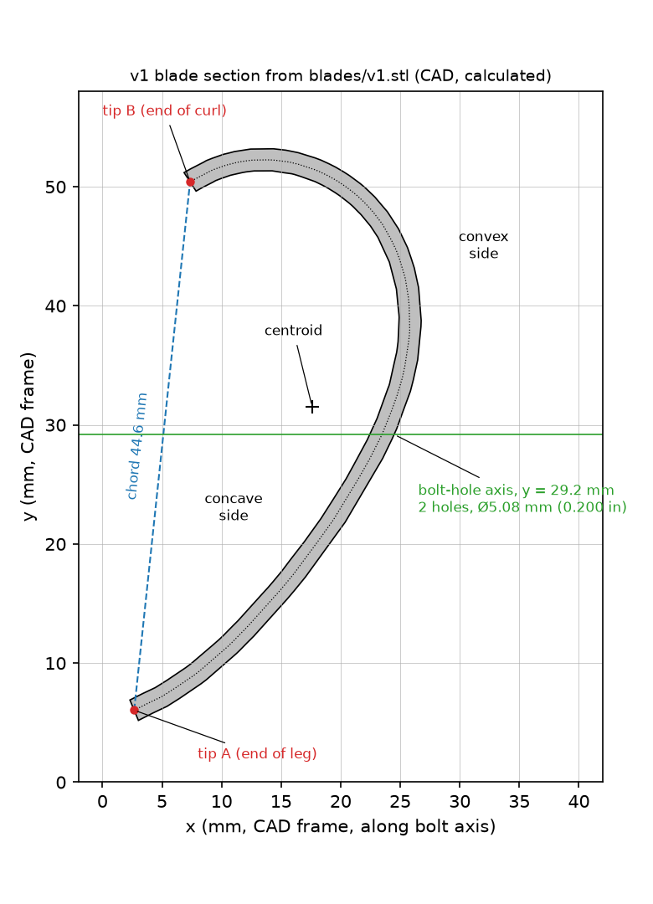

# Measurements the CFD needs

Drafted 7 Oct 2026. Three inputs for `cfd/PLAN.md` stages 2–4 (stages 0 and 1 do not need them):

1. rotor assembly geometry;
2. test-section geometry;
3. freestream turbulence intensity, Tu.

Record results in the template in §5 and save its JSON block as `cfd/inputs/rig_geometry.json`.
Status labels: **measured** (with date), **CAD** (calculated from `blades/v1.stl` by
`cfd/measurements/blade_section_cad.py`), **recorded** (written in the repo, method not stated),
**inferred**, **unknown**.

## 0. Already known: do not re-measure

| Item | Value | Status | Source |
|---|---|---|---|
| Rotor type | H-rotor VAWT, 3 straight blades | recorded | `data/tunnel.json` `turbine.type` |
| Attachment radius R | 101.6 mm (4 in), "shaft centre to where the blade meets the arm" | measured 25 Aug 2026 (method not recorded) | `data/tunnel.json` `turbine._radius_note`; `data/load_facts.json` |
| Span H | 245.1 mm; zero twist; prismatic section | CAD | `blades/v1.json` |
| Swept area used for C_P | 2RH = 0.0498 m², on R, not on the outer radius | calculated | `data/tunnel.json`; package `DATA_DICTIONARY.md` |
| Blade section | see figure and the next subsection | CAD | `cfd/measurements/blade_section_cad.json` |
| Printed blades = CAD | slicer plates have the same bounding box (24.46 × 48.03 × 245.11 mm); end caps, square edges and hole bores carry no fuzzy skin | recorded | `reports/roughness_2026-09/inputs/slicer/turbine_default_summary.json` |
| Mount | rotor inserted into the mount's cylindrical shaft; same mount, generator and bearings for every rotor | recorded | `reports/roughness_2026-09/report/report.tex` §2.1 |
| Wobble | visible at higher wind speeds; not measured | observed | `report.tex` §3; `reports/roughness_2026-09/HANDOFF.md` |
| Planned change | redesigned base plate with a longer shaft | proposed | `reports/roughness_2026-09/MEETING_2026-10-07_Jahangiri.md` |
| Tachometer magnet | glued to one blade, re-glued per set; mass and position not recorded | recorded | `report.tex` §2.2; `reports/roughness_2026-09/EDIT_LOG.md` |
| Generator | 3-phase, on the rotor shaft; make and model not recorded | recorded | `report/rig_diagram.tex`; `EDIT_LOG.md` item 6 |
| Hub, arms, end plates, setting angle, rotation sense, which face sits at R | not in the repo; `~/Downloads/turbine.STEP` holds one blade only | unknown | `cfd/PLAN.md` |
| End plates in `docs/diagrams` | schematic drawing, not a record | n/a | `docs/diagrams/build_diagrams.py` `vawt()` |
| Fan and drive | ABB ACS550, 15 HP motor, fan max 2435 rpm | recorded | `data/tunnel.json`; `reference/README.md` |
| Wind speed | v = 0.02132·N − 0.424 m/s (N fan rpm); Test 1 measured 0–700 rpm only (8 points), extrapolated above | measured to 700 rpm | `data/tunnel.json` `calibration`; `data/test1_rpm_velocity.csv` |
| Test 1 sensor | cup or vane anemometer (by fit); position in the tunnel not recorded | inferred | `docs/11_open_questions.md` §5 |
| Tunnel layout | has a diffuser; nothing else recorded | recorded | `FIELD_CARD.md`; `docs/10_commissioning.md` |
| Speed response | τ = 0.60 ± 0.14 s, corner 0.27 Hz | measured | `data/tunnel.json` `tau` |
| Test-section size, blockage | not recorded; the reports apply no blockage correction | unknown | `report.tex` §2.2; `HANDOFF.md` open item 3 |
| Per-session field | dashboard has a free-text "Test section configuration" | n/a | `webapp/templates/index.html` |
| Tu | not measured | unknown | `cfd/PLAN.md` Risks |
| Existing anemometer record | 300 Hz, but noise-dominated: about 13 mV rms with the fan off against 66–237 mV plateau means. It cannot give Tu. | calculated 7 Oct | `reference/data/03162026_sec_backup.xlsx` with `src/daq_survey.py` plateaus |
| Tunnel node (Nano 33 BLE Sense Lite) | LPS22HB temperature and pressure give ρ; external I²C bus (A4/A5) is free; mbed `Wire` costs about 425 µs per transaction plus 95 µs per byte | calculated from bench-measured rates (504 and 399 Hz) | `firmware/tunnel_node/tunnel_node.ino`; port in `data/tunnel.json` |

### Found while compiling this list (CAD, 7 Oct)



- **The section is not a circular arc.** A single circle fits the midline with 1.97 mm rms, about
  one wall thickness. It is a long, flatter leg (radius of curvature about 56 mm) that turns into a
  tight curl (about 12.5 mm). "Chord 48.0 mm, depth 24.46 mm" are the CAD bounding-box extents.
  The tip-to-tip chord is **44.6 mm**. The depth from the chord to the convex face is **20.6 mm**, at
  71% of the chord from tip A. The wall turns 190° between the square edges; the 183° in
  `blades/v1.json` is not reproduced.
- **The wall is 1.85 mm** (1.854 mm across each square edge; area/midline 1.848 mm). The 1.79 mm in
  `blades/v1.json` and `rotor_geometry.json` is 2V/A over the whole mesh. That method counts the end
  caps, edges and hole bores in A, so it reads low. This settles PLAN.md missing input 3 for the
  CAD; item 1.15 checks the printed wall.
- **Two mounting holes**, Ø 0.200 in (5.08 mm). Their axis is parallel to CAD x, at y = 29.2 mm.
  They sit 110.0 and 119.9 mm from the **near end** and 125.2 and 135.1 mm from the far end
  (mid-span is 122.6 mm). They pierce the wall where the leg turns into the curl. **The chord line
  is at 84.0° to the hole axis.**

These change the Stage 0 section generator: build it from the mesh, not from a circular arc.

---

## 1. Rotor assembly geometry

**Why needed.** Stage 3 places three copies of the section on a circle and rotates them. Torque
depends on four things: where each section sits, its angle to the radius, which face the wind hits
on the downwind-moving blade, and the rotation sense. R = 101.6 mm is known, but not which point
of the section sits there. With the bolts radial, the choice of arm face alone moves the outer
radius from 106 to 126 mm (table below). That is a swept area of 0.052 or 0.062 m², against the
0.0498 m² used for C_P. Hub, arms, shaft and end plates are what a 2D model leaves out, and they
add to the blockage area. Shaft engagement and clearance set the wobble, which the report names as
a candidate mechanical cause.

**Terms.**
- **Tip A / tip B:** the square edge at the end of the long leg / at the end of the curl (figure).
- **Near end:** the blade end nearer the holes.
- **Attachment point:** where the blade touches the arm. R runs from the shaft axis to this point.
- **r_A, r_B:** distance from the shaft axis to tip A and to tip B.
- **Setting angle β:** angle between the chord line (tip A to tip B) and the radial line through
  the attachment point.

### What to measure
1. Rotation sense viewed from above (CW or CCW).
2. Which tip leads in rotation.
3. On a blade moving downwind, does the wind meet the concave or the convex face?
4. Which face touches the arm: concave or convex.
5. Bolt direction relative to the arm (along the arm, across it, or other); screw size; washers
   and spacers.
6. r_A and r_B for each blade, at mid-span and, if reachable, at both ends.
7. R, re-measured to the attachment point, with the method written down.
8. Tip A to the next blade's tip A, for all three pairs. This checks 6 without reaching the axis.
9. r_max, the outermost point of any blade (rotor diameter 2·r_max).
10. Is the near end at the top or the bottom?
11. Arms: number per blade; height of the arm centreline above the blade's bottom end; length;
    width in the rotation direction; thickness; cross-section shape.
12. Hub and end plates (discs): present or not, outer diameter, thickness, height, gap to the blade
    ends.
13. Central shaft: does it run up between the blades? Its outer diameter and top height. Gap from
    each blade's innermost point to the shaft surface.
14. Mount:
    - inner diameter of the socket (the mount's cylindrical shaft);
    - outer diameter of the rotor's spigot;
    - engagement length;
    - set screws or keys;
    - generator shaft diameter;
    - height of the top bearing below mid-span.
15. Section check on one Plain blade, against CAD:
    - tip-to-tip chord (44.6 mm);
    - depth from the chord to the convex face (20.6 mm);
    - wall across a square edge (1.85 mm);
    - hole diameter (5.08 mm);
    - hole centres from the near end (110.0 and 119.9 mm).
16. Runout of the installed rotor: radial at the top of each blade, and axial at the top end.
17. Heights in the test section: floor to the blade bottom end, and blade top end to the ceiling.
18. Tachometer magnet: mass, size, radius and height. This is for balance, not for the CFD.

### Tools
- Digital calipers, 150 mm, with a depth rod.
- 300 mm steel rule and a 5 m tape.
- Protractor or angle finder.
- Plumb bob or string with a nut.
- Feeler gauges.
- Dial indicator on a magnetic base, or a fixed block plus the calipers' depth rod.
- 0.01 g scale.
- Masking tape and a marker.
- Phone camera (2× or 3× lens) and a phone level app.

### Procedure
Fan stopped, keypad in LOC and the E-stop pressed for every step except A3.

**A. Rotor in place**
1. Flag the blades B1, B2 and B3 with tape; B1 carries the magnet. On each blade, mark tip A and
   tip B. Tip B is on the curl.
2. Take the photos. In each, put a ruler in the plane being measured, keep the camera square to
   that plane (level app at 0°), and shoot with the 2× or 3× lens from at least 0.5 m:
   - **R1:** top view straight down the shaft axis, whole rotor, with a ruler across the top at
     blade-end height;
   - **R2:** top-view close-up of B1's end, its arm and the hub;
   - **R3:** side view of the full rotor and mount, with a tape vertical from the floor;
   - **R4:** the arm-to-blade joint, from both sides.
3. Rotation sense (items 1–3). Run the fan at 500 rpm (about 10 m/s) for 20 s, with the load
   interlock as usual, and take a slow-motion video from above or through the window. Record CW or
   CCW seen from above, the leading tip, and the face the wind meets on the downwind-moving blade.
   Stop the fan and lock out.
4. Radii (items 6–9). Measure the shaft outer diameter. Then measure from the shaft surface to tip A
   and to tip B of each blade, and add the shaft radius. Measure tip A to tip A between neighbours.
   Measure r_max as half the largest tip-to-tip span across the rotor.
5. Arms, hub, end plates and shaft (items 4, 5, 10–13). Note which face the arm touches and how the
   bolts run.
6. Runout (item 16). Fix the indicator, or a block plus the depth rod, against the convex face of
   B1 about 10 mm below its top. Turn the rotor slowly by hand and record max − min. Repeat for B2,
   B3 and axially at the top end.
7. Heights (item 17): floor to the blade bottom end; blade top end to the ceiling; floor to the arm;
   floor to the hub.

**B. Rotor removed**
8. Mount (item 14). Measure the socket's inner diameter at three angles, near the top and the bottom
   of the bore. Measure the spigot's outer diameter the same way. Measure the engagement length with
   the depth rod. Take photo **R5**: socket and spigot side by side with a ruler.
9. Section check (item 15), on a Plain blade at mid-span. The square edges and hole bores carry no
   fuzzy skin on any set. Take photo **R6**: the blade end-on on a table, ruler at the end plane,
   camera square to it.
10. Magnet (item 18). Take photo **R7**; weigh the magnet if it comes off.
11. Remount the rotor and repeat step 4 on B1. This checks repeatability.

Send the numbers and photos. The section pose (position and β) is then solved from r_A, r_B and R,
and checked against R1.

**Expected values (CAD, bolts radial, R = 101.6 mm to the face the arm touches).** Other bolt
directions give other values; steps 4–5 resolve any case.

| | Arm on the concave face (concave side toward the shaft) | Arm on the convex face (concave side outward) |
|---|---|---|
| r_A | 85.0 mm | 125.6 mm |
| r_B | 89.1 mm | 120.6 mm |
| r_min (innermost point) | 84.5 mm | 99.8 mm |
| r_max (outermost point) | 106.4 mm | 125.8 mm |
| tip A to next tip A (√3·r_A) | 147.3 mm | 217.5 mm |
| β (chord to radial line) | 84° | 84° |

**Wobble arithmetic (geometric, small angle).** With diametral clearance c = socket ID − spigot OD
and engagement length L_e, the rotor can tilt by up to c/L_e rad. The blade top, at height h above
the top of the socket, can then move by up to h·c/L_e. Doubling L_e halves both.

### Accuracy needed
| Quantity | Accuracy |
|---|---|
| Rotation sense, leading tip, face the wind meets, arm face, bolt direction | exact |
| r_A, r_B, R, r_max | ±1 mm (1% of R; λ and C_P scale with radius) |
| β | ±2° |
| Arms, hub, end plates, shaft | ±1 mm; heights ±2 mm |
| Socket and spigot diameters | ±0.02 mm (clearance is the difference of two close numbers) |
| Engagement length | ±0.5 mm |
| Runout | ±0.1 mm with a dial indicator; ±0.3 mm with calipers |
| Section check | chord and depth ±0.1 mm; wall ±0.02 mm |

### Fallback
- Ask T. Richards, author of the CAD, for the hub, arm and mount CAD or drawings.
- If the pose cannot be measured, run Stage 3 for both arm-face cases in the table. Use the
  rotation sense that makes the concave face meet the wind on the downwind-moving blade (the
  drag-rotor case; inferred). Keep the case whose λ at peak power and zero-torque λ match the rig
  (`reports/roughness_2026-09/build/tacho/derived/`).
- If β is not measured, use 84° (bolts radial) ± 5°.
- The holes are at mid-span, so the arm presumably is too (inferred). Slice the 2D model at quarter
  span, away from the arm, and say so.

---

## 2. Test-section geometry

**Why needed.**
- **Blockage.** The rotor and its mount reduce the open area, so air at the rotor moves faster than
  the calibration speed. The blockage ratio is ε = A_frontal / A_section. Above about 5%, absolute
  C_P and any CFD comparison need a correction. Rotor-to-rotor ratios largely cancel it (inferred).
  Example only: A_frontal = 2·r_max·H is 0.052–0.062 m² for the two CAD cases, which gives
  ε = 10–12% in a 0.5 m² section.
- **Stage 4** puts the walls in the domain, so it needs W, H, L and the rotor position.
- **Closed walls or open jet.** Each needs a different correction.
- **Blade-section test** (meeting item 1). The printed slice or its end plates are sized to the
  section.

### What to measure
1. Type: closed walls, open jet or slotted; doors and windows in the walls.
2. Inside width and height at the entrance, at the rotor axis and at the exit; corner fillets.
3. Length, from the contraction exit to the diffuser start.
4. Rotor axis position: from the entrance, to the exit, and to the left and right walls (looking
   downstream).
5. Blade bottom end to floor; blade top end to ceiling (the same as item 1.17).
6. Contraction: settling-chamber width and height, and contraction length. The contraction ratio is
   settling area / section area.
7. Flow conditioning:
   - honeycomb: present or not, cell size, depth;
   - screens: number, mesh count (wires per 25.4 mm), wire diameter.
8. Fan:
   - upstream (blowing) or downstream (sucking) of the section;
   - diameter;
   - number of fan blades (blade-passing frequency = fan rpm / 60 × blades, to recognise its
     peak in the Tu spectrum);
   - open or closed return.
9. Obstructions in the section, each with its frontal width × height and its position relative to
   the rotor axis:
   - mount and base plate;
   - generator housing and the shaft below the rotor;
   - tachometer sensor and bracket;
   - anemometer or probe stands;
   - cables;
   - the Nano.
10. Wind-speed reference: where the Test 1 anemometer was on 13 Feb, and whether the section was
    empty then. Test 1 is reported in Eacuello and Connelly's March report (`reference/README.md`).

### Tools
- 5 m tape, steel rule and calipers.
- Laser distance meter, if available.
- Flashlight.
- Plumb bob.
- Phone camera.

### Procedure
1. Fan stopped and locked out.
2. Take the photos, each with a tape or ruler in frame:
   - **S1:** looking downstream from the entrance, tape across the width;
   - **S2:** side view, tape along the length, rotor visible;
   - **S3:** contraction, honeycomb and a screen, with a ruler on the honeycomb and on the screen
     (count wires over 25.4 mm on the photo);
   - **S4:** fan, diffuser and outlet or return;
   - **S5:** mount, base plate and generator in the section;
   - **S6:** sensor stands;
   - **S7:** any nameplate or drawing of the tunnel.
3. Width and height (item 2). Take three readings at each station: width at mid-height, height at
   mid-width. Record the mean.
4. Rotor position (item 4). Hang a plumb line from the hub centre and measure from the line to each
   wall, to the entrance and to the exit.
5. Items 6–9, then item 10 from memory or notes.
6. Compute ε = (2·r_max·H + A_hub + A_end-plates + A_arms + A_mount-in-flow) / (W·H at the rotor).
   Count the arms at their largest projection.
7. For every rotor run from now on, write the configuration in the dashboard's "Test section
   configuration" field.

### Accuracy needed
| Quantity | Accuracy |
|---|---|
| W, H | ±2 mm (the relative error in ε equals the relative error in area, about 0.5%) |
| Length | ±10 mm |
| Rotor position | ±5 mm |
| Obstructions | ±2 mm |
| Section type, fan position, screen count | exact |
| Mesh count | ±10% |

### Fallback
- Ask the lab manager or Prof. Jeong for the tunnel drawings or the maker's data.
- Failing that, run stages 1–3 unbounded (no walls) and state that no blockage correction is
  applied, as the report does. Add a sensitivity line at ε = 5, 10 and 15%.

---

## 3. Freestream turbulence intensity, Tu

**Definition.** Tu = u_rms / U, where u is the streamwise velocity at the rotor location with the
rotor removed. Only fluctuations above 1 Hz count. Below that is fan-speed wander: the
drive-to-air response has τ = 0.60 s and a corner at 0.27 Hz.

**Why needed.**
- kOmegaSSTLM (free-transition runs in stages 1 and 2) predicts transition from the freestream Tu.
- The Langtry–Menter (2009) onset correlation, at zero pressure gradient, gives Re_θt ≈ 880 at
  Tu = 0.5%, 584 at 1% and 182 at 3% (calculated). That is a factor of five across the plausible
  range.
- Tu sets the inlet k = 1.5·(Tu·U)² (isotropy assumed) and the inlet Re_θt. The integral length
  scale L sets ω.
- **The roughness hypothesis (inferred).** If freestream turbulence already makes the smooth blade's
  boundary layer transitional, fuzzy skin has less to trip.

### Options
| Method | Resolves | Access | Role |
|---|---|---|---|
| Pitot-static tube with a fast differential pressure sensor (Sensirion SDP810 or SDP3x) on a Nano | to a few hundred Hz with ≤ 10 cm tubes | parts in the tens of dollars | **do first.** Gives a lower bound, plus a calibration check above 700 rpm. |
| Hot-wire CTA, single wire | above 10 kHz | borrow in the department, or rent | reference method; one point calibrates the pitot result |
| Cobra probe (TFI, 4-hole) | about 2 kHz, three components | borrow or rent | good if available |
| Existing anemometer | about 1 Hz | have it | not usable (§0) |

### Procedure A: pitot-static tube and SDP sensor

**Hardware**
- **Probe.** A Prandtl (pitot-static) tube, 3–8 mm OD. Hold it on a stand at the rotor axis
  position and mid-span height, pointing upstream within ±3° (check with the angle finder).
- **Sensor.**
  - Sensirion SDP810-500Pa (barbed ports; ±500 Pa, so up to about 28 m/s, where q = 470 Pa);
  - plus SDP810-125Pa for the 10 m/s point;
  - SDP31 and SDP32 on a ported breakout are equivalent;
  - SDP33 (±1500 Pa) would reach 38 m/s; check that it can be obtained.
- **Board.** A Nano 33 BLE (the tunnel node or a second board): SDA to A4, SCL to A5, 3.3 V and
  GND. Add 4.7–10 kΩ pull-ups to 3.3 V if the breakout has none. The on-board sensors use `Wire1`,
  so A4/A5 (`Wire`) is free.
- **Tubing.** Silicone, 1.5–2 mm ID, at most 10 cm per port, both the same length. Mount the
  sensor on the stand. Longer tubes filter the fluctuations.

**Firmware** (not written yet; it can be added as a `PITOT` burst mode in
`firmware/tunnel_node/` or as a separate sketch)
- Start continuous measurement in "differential pressure, average till read" mode. The SDP3x/8xx
  datasheet command is 0x3615; confirm it against the datasheet.
- On a 1.000 ms timer, read 3 bytes (pressure word and CRC).
- Store int16 values in RAM, then dump them with timestamps. 60 s × 1 kHz × 2 B = 120 kB, which
  fits the nRF52840's 256 kB.
- Read the scale factor from the sensor's third output word, once, at start-up.
- Speed limit: measured `Wire` overheads put one 3-byte read near 0.7 ms. 1 kHz is feasible;
  2 kHz is not.

**Runs** (rotor removed; constant set points only; never during a gust or turbulence profile)
1. Take photo **T1**: the probe in place, with a ruler. Record T, p and ρ with
   `python src/tunnel_node.py read`, at the start and at the end.
2. Fan off: record 60 s (zero offset and noise floor).
3. Fan at 500, 700, 900, 1100 and 1300 rpm (10.2, 14.5, 18.8, 23.0 and 27.3 m/s by the
   calibration):
   - mixed order, e.g. 900, 500, 1300, 700, 1100;
   - three passes;
   - at each point, wait 15 s after the fan settles, then record 60 s.
4. Fan off: record 60 s again.
5. Uniformity (optional): at 1100 rpm, record 4 more points, at ±100 mm left/right and up/down of
   the centre.
6. Tubing check: repeat 1100 rpm with 30 cm tubes. If Tu falls by more than about 20%, the 10 cm
   result is also bandwidth-limited; report it as a lower bound.

**Analysis**
- q = mean(Δp) − zero offset (the mean of the two fan-off records).
- U = √(2q/ρ). Compare U with the calibration; this checks it above 700 rpm.
- Apply a 1 Hz high-pass (4th-order Butterworth, zero phase). Then
  σ² = var(Δp_hp) − var(zero_hp).
- **Tu = σ / (2q).** This follows from Δp = ½ρu², so Δp′ ≈ ρUu′; it holds for Tu ≪ 1.
- Welch PSD with 1 s segments. Mark spikes at 60 Hz harmonics and at the fan blade-passing
  frequency, and report Tu with and without them.
- L = U·T_int, where T_int is the integral of the autocorrelation up to its first zero.
- Report mean ± s.d. over the three passes at each speed.
- **Detectability.** At 10 m/s, q ≈ 60 Pa, so Tu = 0.5% means σ ≈ 0.6 Pa. The fan-off noise must
  be well below that. That is why the zero records matter, and why the 125 Pa sensor is used at the
  lowest speed.

```python
import numpy as np
from scipy import signal

def tu_from_pitot(dp, dp_zero, rho, fs=1000.0, f_hp=1.0):
    """dp, dp_zero: Pa (fan running, fan off). Returns U [m/s], Tu [-], L [m]."""
    sos = signal.butter(4, f_hp, "highpass", fs=fs, output="sos")
    x, z = signal.sosfiltfilt(sos, dp), signal.sosfiltfilt(sos, dp_zero)
    q = dp.mean() - dp_zero.mean()
    U = np.sqrt(2 * q / rho)
    Tu = np.sqrt(max(x.var() - z.var(), 0.0)) / (2 * q)
    r = signal.correlate(x - x.mean(), x - x.mean(), mode="full", method="fft")[len(x) - 1:]
    r /= r[0]
    k0 = int(np.argmax(r <= 0))
    return U, Tu, U * r[:k0].sum() / fs
```

**Limitation.** With the tube and a 1 kHz sensor, the method resolves fluctuations up to a few
hundred Hz. It misses energy above that, so the result is a lower bound. Frequencies scale with U,
so the lowest speed captures the largest share. One hot-wire point at 10 m/s would measure the
shortfall.

### Procedure B: hot-wire CTA (if one can be borrowed)
1. Use a single normal wire (5 µm tungsten). Set the overheat as the instrument's manual specifies.
   Run the square-wave test and confirm a cutoff above 10 kHz.
2. Put the probe in the same position as in Procedure A. Calibrate it there against the pitot (the
   Procedure A hardware) at about 10 speeds, 300–1300 rpm. Fit U(E) with a 4th-order polynomial or
   King's law, and record the temperature at each point for the correction.
3. Sample at 20 kS/s or faster, with a 10 kHz anti-alias filter, for 30–60 s per point. Use the
   same speeds as Procedure A, plus 1800 rpm (about 38 m/s). This needs a DAQ with ≥ 20 kS/s and
   ≥ 12 bits, such as the lab DAQ if its rate allows.
4. Convert E(t) to U(t) sample by sample. Tu = std(U_hp) / mean(U). Compute L the same way as in
   Procedure A.

### Procedure C: Cobra probe
Mount it as in Procedure A and run its software at its maximum rate, for 60 s per point, at the same
speeds. Report the streamwise u_rms / U, so the result matches the other methods.

### Expected values (general wind-tunnel practice, not measured here)
| Tunnel | Typical Tu |
|---|---|
| Research tunnel with honeycomb, several screens and a contraction of 6:1 or more | below 0.2% |
| Small teaching or industrial tunnel | 0.5–3% |
| Fan blowing straight into the section, little conditioning | can exceed 3% |

The inlet photos (§2 items 6–8) narrow this range before any measurement.

### Accuracy needed
- Tu: ±30% of its value (e.g. 1.0 ± 0.3%), which is enough to choose among the CFD's 0.5, 1 and 3%.
- L: within a factor of 2.
- Mean U at the probe: ±2%.

### Fallback
- Keep PLAN.md's bracket (0.5, 1 and 3%) and report every free-transition result as a band.
- Use the inlet photos to say which end of the bracket is likely.
- If only Procedure A works, use its value as the lower end of the bracket.

---

## 4. Suggested session (about 3 h, one person plus one helper)
1. Rotor in place: steps 1A.1–7, including the 20 s run for rotation sense (40 min).
2. Rotor removed: steps 1B.8–10 (30 min).
3. Test section: §2, steps 1–5 (45 min).
4. Tu, Procedure A, rotor removed (60 min).
5. Rotor remounted: step 1B.11 (10 min).

Name photos `cfd/inputs/photos/YYYYMMDD_<code>.jpg`, using the codes R1–R7, S1–S7 and T1.

---

## 5. Record template

| # | Quantity | Value | Unit | Method / tool | Photo | By, date |
|---|---|---|---|---|---|---|
| 1.1 | Rotation sense from above (CW/CCW) | | | slow-motion video | | |
| 1.2 | Leading tip (A/B) | | | video | | |
| 1.3 | Face the wind meets on the downwind-moving blade (concave/convex) | | | video | | |
| 1.4 | Face touching the arm (concave/convex) | | | | R4 | |
| 1.5 | Bolt direction relative to the arm; screw size | | | | R4 | |
| 1.6 | r_A, r_B for B1 / B2 / B3 (mid-span) | | mm | calipers + shaft radius | R1 | |
| 1.7 | R to the attachment point | | mm | | R2 | |
| 1.8 | Tip A to next tip A (B1–B2, B2–B3, B3–B1) | | mm | | | |
| 1.9 | r_max | | mm | | R1 | |
| 1.10 | Near end at top or bottom | | | | R3 | |
| 1.11 | Arms: number per blade; height above blade bottom; length × width × thickness; shape | | mm | | R3, R4 | |
| 1.12 | Hub / end plates: OD, thickness, height, gap to blade ends | | mm | | R3 | |
| 1.13 | Central shaft through rotor (y/n); OD; top height; blade-to-shaft gap | | mm | | R1 | |
| 1.14 | Socket ID; spigot OD; engagement length; set screws; generator shaft OD; top bearing below mid-span | | mm | calipers, depth rod | R5 | |
| 1.15 | Section check: chord; depth; wall at edge; hole Ø; holes from near end | | mm | calipers | R6 | |
| 1.16 | Runout: radial B1/B2/B3 at top; axial at top end | | mm | dial / calipers | | |
| 1.17 | Floor to blade bottom; blade top to ceiling | | mm | tape | R3 | |
| 1.18 | Magnet: mass; size; radius; height | | g, mm | scale | R7 | |
| 2.1 | Section type (closed / open jet / slotted) | | | | S1 | |
| 2.2 | Width × height at entrance / rotor / exit | | mm | tape, 3 readings | S1 | |
| 2.3 | Section length | | mm | tape | S2 | |
| 2.4 | Rotor axis: from entrance; to exit; to left wall; to right wall | | mm | plumb line + tape | S2 | |
| 2.5 | Blade heights: see 1.17 | | | | | |
| 2.6 | Settling chamber W × H; contraction length; ratio | | mm, - | | S3 | |
| 2.7 | Honeycomb cell, depth; screens: count, mesh, wire Ø | | mm, /in | photo + ruler | S3 | |
| 2.8 | Fan position; diameter; blades; open or closed return | | | | S4 | |
| 2.9 | Obstructions: name, width × height, position | | mm | | S5, S6 | |
| 2.10 | Test 1 anemometer position; section empty? | | | memory, notes | | |
| 2.11 | Blockage ratio ε | | % | calculated | | |
| 3.1 | Method and probe position | | | | T1 | |
| 3.2 | Air T, p, ρ (start / end) | | °C, Pa, kg/m³ | tunnel node | | |
| 3.3 | Fan-off noise floor | | Pa rms | | | |
| 3.4 | Per speed: fan rpm, U, Tu (≥ 1 Hz), Tu (all), L, s.d. over 3 passes | | m/s, %, mm | | | |
| 3.5 | Uniformity: U and Tu at the 4 off-centre points | | m/s, % | | | |
| 3.6 | Tubing check: Tu with 10 cm vs 30 cm | | % | | | |

Copy this block to `cfd/inputs/rig_geometry.json` and fill it in. `null` means not measured. Units
are in the key names. Allowed values: `rotation_sense_from_above` is CW or CCW; `leading_tip` is A
or B; `face_wind_meets_on_downwind_blade` and `arm_face` are concave or convex; `near_end` is top
or bottom; `section_type` is closed, open_jet or slotted; `fan_position` is upstream or downstream;
`circuit` is open_return or closed_return.

```json
{
  "_README": "Rig geometry and inflow for the CFD. Filled from cfd/MEASUREMENTS_NEEDED.md. null = not measured. Every block records who measured it, when, and how.",
  "rotor": {
    "measured_by": null,
    "date": null,
    "n_blades": 3,
    "attachment_radius_mm": 101.6,
    "attachment_radius_status": "measured 25 Aug 2026, method not recorded",
    "rotation_sense_from_above": null,
    "leading_tip": null,
    "face_wind_meets_on_downwind_blade": null,
    "arm_face": null,
    "bolt_direction": null,
    "screw_size": null,
    "r_tipA_mm": [null, null, null],
    "r_tipB_mm": [null, null, null],
    "tipA_to_next_tipA_mm": [null, null, null],
    "r_max_mm": null,
    "setting_angle_deg": null,
    "near_end": null,
    "arms": {"per_blade": null, "height_above_blade_bottom_mm": null, "length_mm": null, "width_mm": null, "thickness_mm": null, "shape": null},
    "hub": {"present": null, "od_mm": null, "height_mm": null, "z_floor_mm": null},
    "end_plates": {"present": null, "od_mm": null, "thickness_mm": null, "gap_to_blade_end_mm": null},
    "central_shaft": {"runs_through_rotor": null, "od_mm": null, "top_above_floor_mm": null, "blade_to_shaft_gap_mm": null},
    "mount": {"socket_id_mm": null, "spigot_od_mm": null, "engagement_length_mm": null, "set_screws": null, "generator_shaft_od_mm": null, "top_bearing_below_midspan_mm": null},
    "section_check": {"blade": null, "chord_tip_to_tip_mm": null, "depth_chord_to_convex_mm": null, "wall_at_edge_mm": null, "hole_d_mm": null, "holes_from_near_end_mm": [null, null]},
    "runout": {"radial_at_top_mm": [null, null, null], "axial_at_top_mm": null, "method": null},
    "heights": {"floor_to_blade_bottom_mm": null, "blade_top_to_ceiling_mm": null},
    "magnet": {"mass_g": null, "size_mm": null, "radius_mm": null, "height_mm": null},
    "photos": []
  },
  "test_section": {
    "measured_by": null,
    "date": null,
    "section_type": null,
    "width_mm": {"entrance": null, "rotor": null, "exit": null},
    "height_mm": {"entrance": null, "rotor": null, "exit": null},
    "corner_fillet_mm": null,
    "length_mm": null,
    "rotor_axis_mm": {"from_entrance": null, "to_exit": null, "to_left_wall": null, "to_right_wall": null},
    "contraction": {"settling_width_mm": null, "settling_height_mm": null, "length_mm": null, "ratio": null},
    "honeycomb": {"present": null, "cell_mm": null, "depth_mm": null},
    "screens": {"count": null, "mesh_per_inch": null, "wire_d_mm": null},
    "fan": {"fan_position": null, "diameter_mm": null, "n_blades": null},
    "circuit": null,
    "obstructions": [
      {"name": null, "width_mm": null, "height_mm": null, "x_from_rotor_axis_mm": null, "z_floor_mm": null}
    ],
    "test1_reference": {"instrument": null, "position": null, "section_empty": null},
    "blockage_ratio_pct": null,
    "photos": []
  },
  "inflow": {
    "measured_by": null,
    "date": null,
    "method": null,
    "probe_position": null,
    "sensor": null,
    "tubing_length_mm": null,
    "fs_hz": null,
    "highpass_hz": 1.0,
    "air": {"T_c": [null, null], "p_pa": [null, null], "rho_kg_m3": [null, null]},
    "noise_floor_pa_rms": null,
    "points": [
      {"fan_rpm": null, "U_m_s": null, "U_calibration_m_s": null, "Tu_pct": null, "Tu_all_pct": null, "Tu_sd_pct": null, "L_mm": null, "passes": null}
    ],
    "uniformity": [
      {"offset_mm": null, "U_m_s": null, "Tu_pct": null}
    ],
    "tubing_check": {"Tu_10cm_pct": null, "Tu_30cm_pct": null},
    "photos": []
  }
}
```
