# Learning log: CFD of the blade section and rotor

A working guide for an engineering graduate student new to CFD, built on this project's own cases.
Every figure except the T3A plot (section 3) is from a case record (`cfd/*/results/records/`, see
[RECORDS.md](RECORDS.md)), so the pictures are of our blade, our meshes and our mistakes. The flow
figures so far come from **test records of 7 Oct** (folder names starting with `_`): start-up flow
0.3-1.1 c/U after an impulsive start, made with the free-stream set-up used before decay control
(section 3). They show how to read each plot, not converged results. Sections marked **[pending]**
wait for production runs; fill them from the named record when it exists, and replace the test
figures then.

Provenance labels, as in the project reports: *literature-established*, *measured* (read from a run
or a log), *calculated* (derived from measured values or geometry), *assumed* (an input chosen
without data), *inferred*, *uncertain*. Numbers without a label are definitions.

Background on the cases: `cfd/PLAN.md` (stages), `cfd/section2d/README.md` (section model),
`cfd/rotor2d/rotor_geometry.py` (rotor assembly hypotheses A and B).

Contents
1. [What a mesh is, and why y+ matters](#1-what-a-mesh-is-and-why-y-matters)
2. [RANS, URANS and LES](#2-rans-urans-and-les)
3. [k-omega SST and the gamma-ReTheta transition model](#3-k-omega-sst-and-the-gamma-retheta-transition-model)
4. [Boundary conditions for external flow](#4-boundary-conditions-for-external-flow)
5. [Courant number and time step](#5-courant-number-and-time-step)
6. [Convergence and averaging windows](#6-convergence-and-averaging-windows)
7. [Forces, coefficients and the Strouhal number](#7-forces-coefficients-and-the-strouhal-number)
8. [Mesh independence and the GCI](#8-mesh-independence-and-the-gci)
9. [Roughness: sand-grain ks against Ra](#9-roughness-sand-grain-ks-against-ra)
10. [Rotating meshes with AMI](#10-rotating-meshes-with-ami)
11. [Validating without a load cell](#11-validating-without-a-load-cell)
12. [Running on a cluster (Unity)](#12-running-on-a-cluster-unity)
13. [References](#13-references)

---

## 1. What a mesh is, and why y+ matters

**The finite-volume idea.** OpenFOAM splits the fluid into cells and stores one value of each
unknown (velocity U, pressure p, turbulence k and omega) per cell. It balances fluxes of mass and
momentum through the cell faces, so every equation becomes "what flows in minus what flows out
equals the change inside". Accuracy depends on how well the cells resolve the gradients: fine
where the flow changes quickly (walls, shear layers, the wake), coarse where it does not.

**Our 2D section mesh.** The case is one cell thick in z, with `empty` front and back faces, so
OpenFOAM solves a 2D problem. Around the blade sits a structured ring of thin cells that follow the
wall (27 layers on the medium mesh, first cell h0 = 4.5 um, growth 1.15 per layer, total 1.28 mm;
calculated by the generator, `mesh_info.json`). Outside the ring, gmsh fills the domain with
quad-dominant cells, refined along the wake, out to a circular far field 27 chords away.

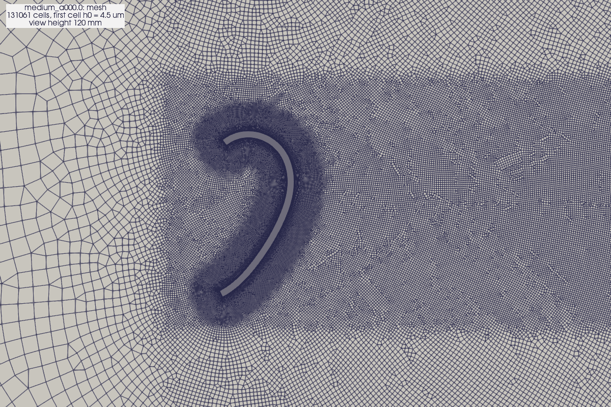

The blade has square end faces 1.85 mm long. The ring wraps them with a fan of cells at each
corner, so the first-cell height holds even there:

| 6 mm view of tip A | 0.8 mm: the layers at the outer corner | 0.1 mm: the first cells |
|---|---|---|
| 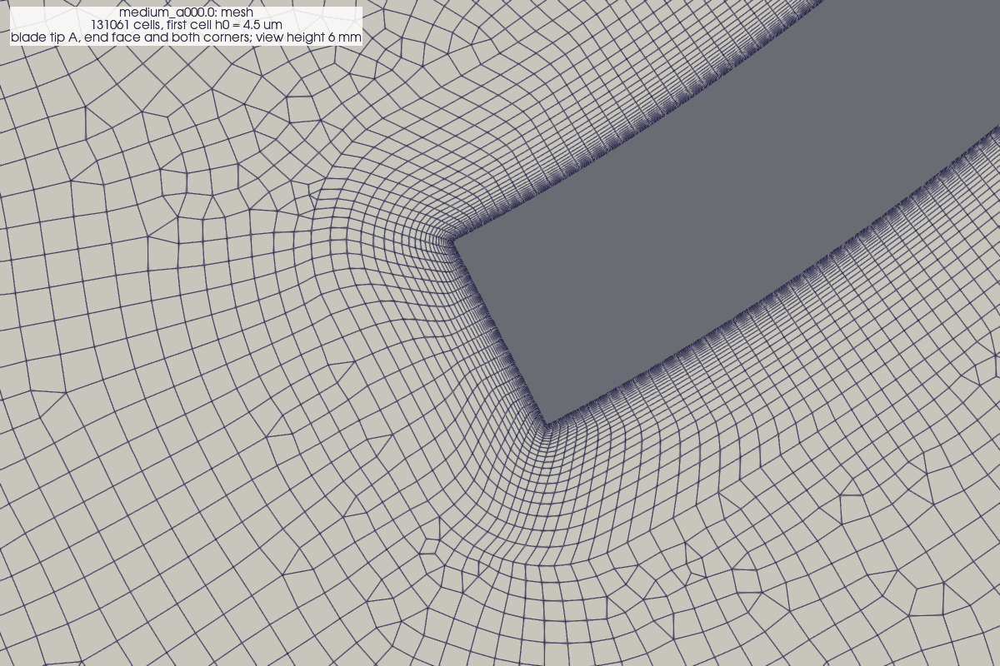 | 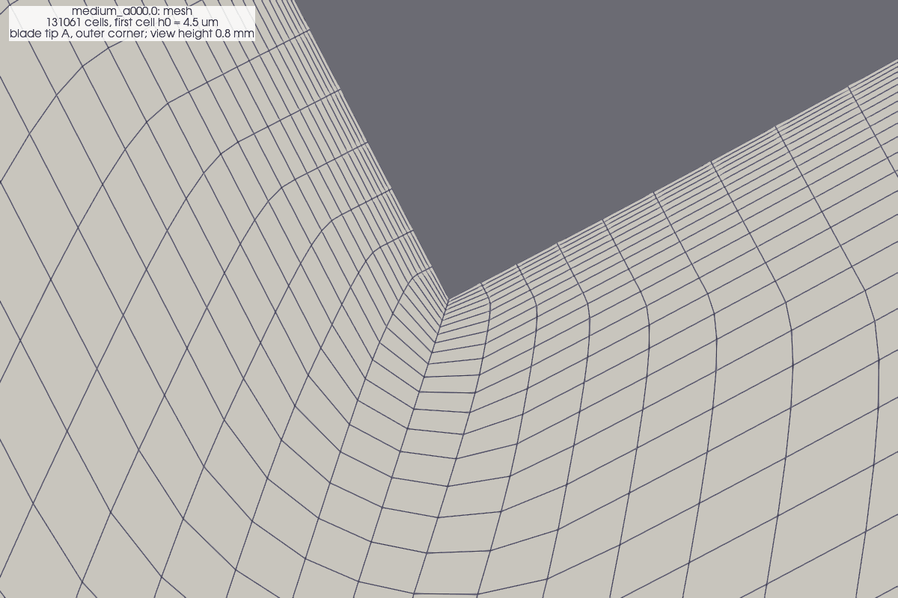 | 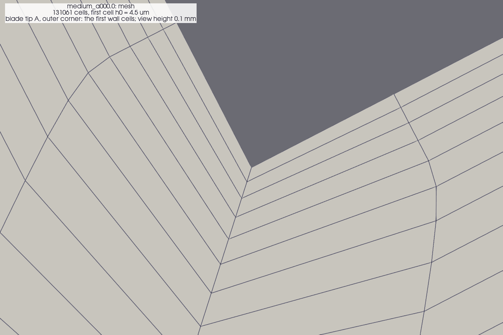 |

**y+.** Near a wall the velocity rises from zero through a thin viscous sublayer into the
logarithmic layer. The natural length unit there is nu/u_tau, where u_tau = sqrt(tau_w/rho) is the
friction velocity. The height of the first cell centre in those units is

    y+ = u_tau y / nu.

- *Literature-established:* the viscous sublayer reaches to about y+ = 5 and the log layer starts
  at about y+ = 30.
- A *low-Reynolds-number* treatment resolves the sublayer and needs y+ of about 1 or less at the
  first cell. The transition model (section 3) needs it too, because it must see the laminar
  boundary layer.
- *Wall functions* skip the sublayer: they put the first cell in the log layer (y+ about 30-300)
  and impose the log law there. They are cheaper, but cannot represent laminar flow or transition.

The section uses the low-Re treatment. The rotor's production mesh uses wall functions
(h0 = 0.87 mm, y+ target 40, `rotor2d/.../_mesh/A_medium_wf_U23.0_th000.0/mesh_info.json`), because
a 3-blade rotor resolved to y+ = 1 would cost too much on this laptop; its transition runs need the
`lowRe` mesh variant (h0 = 12.1 um, *calculated* by the generator). The same blade tip on both rotor
meshes, 6 mm and 0.8 mm views:

| Wall-function mesh (h0 0.87 mm), 6 mm | Low-Re mesh (h0 12.1 um), 6 mm | Low-Re mesh, 0.8 mm |
|---|---|---|
| 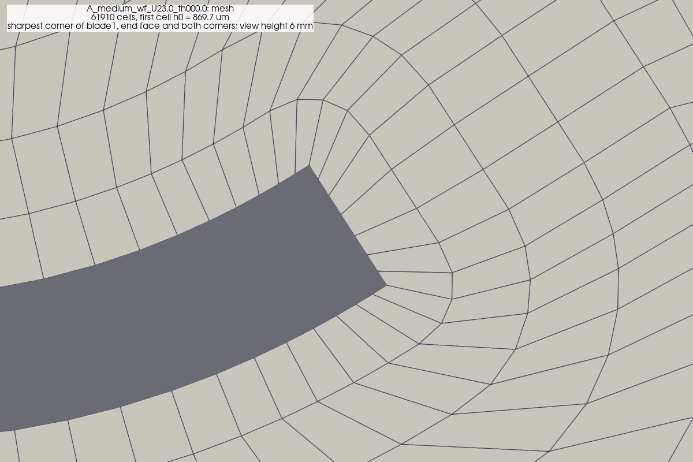 | 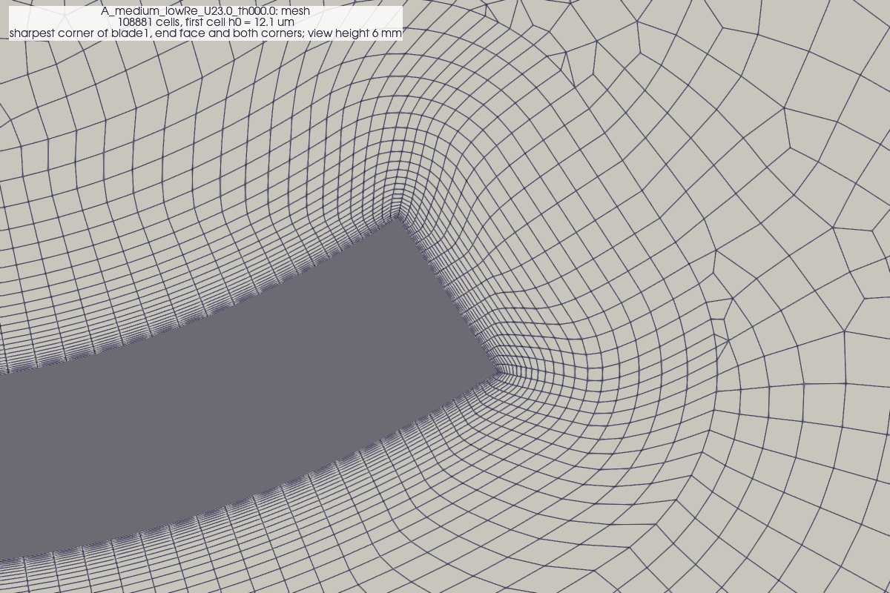 | 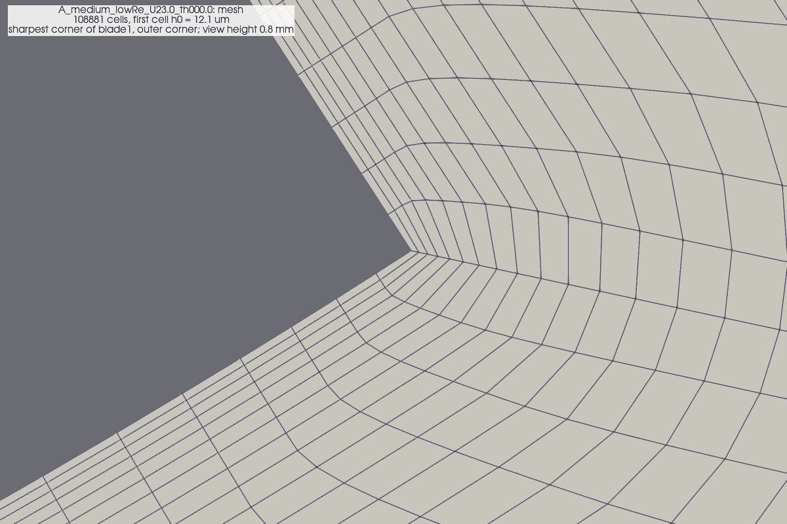 |

**Our y+** (*measured*, coarse SST pipeline test, 0.3 c/U after the start):

- The bottom panel is y+ along the wall, computed in ParaView from the wall shear stress: mean
  0.20, maximum 1.55 on a corner face. OpenFOAM's yPlus function object at the same time gives
  mean 0.200 and maximum 1.46 (*measured*; the comparison is in RECORDS.md, Limits).
- The peaks sit on the end faces and corners (grey bands), where the flow turns 90 degrees around
  a sharp edge and accelerates.
- *Calculated:* scaled to 38 m/s with u_tau proportional to U^0.9, the corner faces reach about
  2.3 and the rest stays below 1 (`section2d/README.md` section 2). A sharp edge always produces
  this peak; refining h0 further would cost time steps (section 5) for four cells.

**What to check in every record:** `yplus.png` (max and mean against time), and the y+ panel of
`fields/surface_mean.png` (where on the wall the maximum sits).

## 2. RANS, URANS and LES

Turbulent flow has eddies from the blade size (centimetres) down to fractions of a millimetre.
Three ways to deal with them:

| Approach | What is solved | What is modelled | Cost here |
|---|---|---|---|
| RANS (steady) | the time-mean flow | all turbulence, through an eddy viscosity nu_t | minutes; but a bluff body's wake is not steady, so it often does not converge |
| URANS (unsteady RANS) | the mean flow plus slow, large-scale unsteadiness (vortex shedding) | the small-scale turbulence, through nu_t | hours per case in 2D (section 5) |
| LES / DDES | the large eddies themselves, in 3D | only the small eddies | needs 3D and weeks on this laptop (HPC, Stage 4) |

We run **2D URANS** (`pimpleFoam`). It captures the von Karman vortex street behind the blade,
which drives the oscillating lift and drag.

**The limitation to keep in mind** (*literature-established*): a 2D simulation forces every vortex
to be perfectly coherent along the span. Real shedding loses coherence over a few diameters, so 2D
URANS tends to overstate the shedding strength and the drag of bluff bodies. Use it for relative
changes (angle against angle, smooth against tripped, rotor A against rotor B), and treat absolute
Cd as an upper-leaning estimate until checked (section 11).

The eddy viscosity shows where the model is adding mixing. In the production cases the free stream
carries nu_t/nu = 10.2 at 23 m/s (Tu 1 %, length scale 1 mm), the same at the far field and at the
blade, because decay control holds it there (*calculated*, `case.json`; section 3). The image below
is a 7 Oct test made before decay control: its free stream carried nu_t/nu of about 38 at the far
field and 35 at the blade (*calculated*, its `case.json`), so its background is redder than a
production image will be. Separated shear layers raise nu_t; the attached boundary layer of a
transition run should stay close to laminar (dark). The dark halo of low nu_t around the body is
*inferred* to be the SST stress limiter (nu_t = a1 k / max(a1 omega, S F2)), which lowers nu_t
where the strain rate S of the flow accelerating round the body is high:

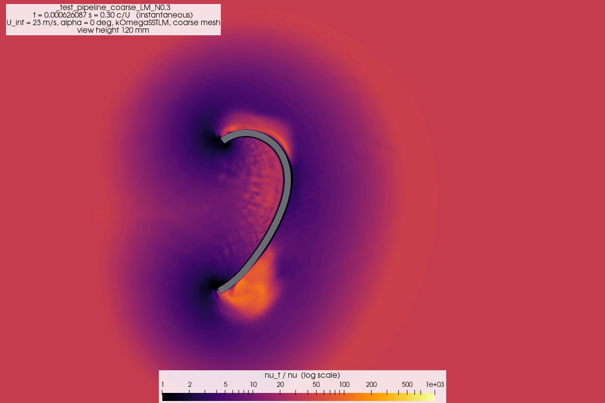

## 3. k-omega SST and the gamma-ReTheta transition model

**k-omega SST** (Menter 1994) solves two transport equations, for the turbulent kinetic energy k
and the specific dissipation rate omega, and sets nu_t from them. It blends a k-omega form near
walls (good in adverse pressure gradients) with a k-epsilon form away from them (insensitive to
the free-stream omega), and limits the shear stress so that separation is not delayed too much.
The coefficients it uses are printed at the top of every solver log (`log_excerpt.txt`, solver
header: alphaK1 0.85, beta1 0.075, a1 0.31, and so on).

SST alone treats the boundary layer as **turbulent from the leading edge** ("fully turbulent").
At our chord Reynolds numbers, Re_c = U c/nu = 3.2e4 (10.2 m/s), 7.3e4 (23 m/s) and 1.2e5 (38 m/s)
(*calculated*, c = 48 mm), the real boundary layer starts laminar and may separate or transition
partway along the blade. That is why the meeting of 7 Oct asked for a transition-capable model.

**gamma-ReTheta (`kOmegaSSTLM`)** (Langtry and Menter 2009) adds two equations:
- *intermittency* gamma (`gammaInt`): near 0 where the boundary layer is laminar (about 0.02,
  where the model's relaminarisation term holds it; *measured* minimum 0.020 in a coarse LM check,
  `section2d/README.md` section 5), 1 where it is turbulent; its effective value scales the
  production of k, so a laminar layer produces almost no turbulence;
- *transition-onset momentum-thickness Reynolds number* ReTheta_t: carries the free-stream
  turbulence level into the boundary layer, through empirical correlations.

Transition starts where the local boundary-layer Reynolds number exceeds a critical value set by
ReTheta_t, which falls as the free-stream turbulence intensity Tu rises. **Tu is therefore an
input**, and the tunnel's Tu is not measured (`cfd/MEASUREMENTS_NEEDED.md`). The section runs
assume Tu = 1 % at the blade and bracket 0.5 and 3 % (queue priority 4).

The intermittency next to the wall at 0.3 c/U (coarse LM test of 7 Oct; view height 5 mm, centred
on the convex wall a quarter of the way round from tip A, so the concave side is left of the grey
wall and the convex side right). The free stream is 1 by its boundary condition; the dark layer
next to the wall is laminar:

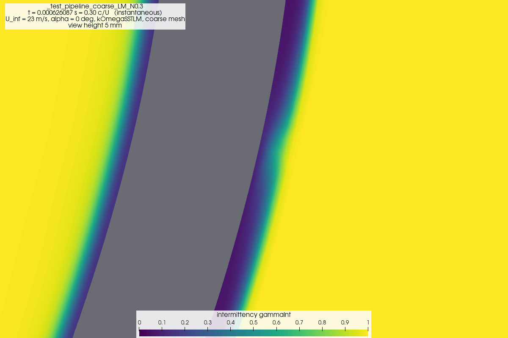

**[pending]** The developed transition pattern: `fields/gammaInt_near.png` and
`fields/surface_mean.png` (Cf sign changes = separation and reattachment) of the first finished
LM production case, e.g. `section2d/results/records/a000.0_U23.0_LM_medium_Tu1.0/`.

### Free-stream turbulence and decay control

In the free stream k and omega have no production, only destruction, so the standard SST
equations let the inflow turbulence decay on its way from the far-field boundary (26.5 chords
upstream of the blade) to the blade. With t = distance / U and the far-field constants
beta = 0.0828, beta* = 0.09:

    k = k0 (1 + beta omega0 t)^(-beta*/beta),    omega = omega0 / (1 + beta omega0 t).

**Stage 1 uses decay control** (Spalart and Rumsey 2007; `section2d/README.md` section 3):
`decayControl yes; kInf ...; omegaInf ...;` in `kOmegaSSTCoeffs` (`constant/turbulenceProperties`,
copied into every record's `settings.txt`). The model then adds beta* omegaInf kInf to the k
equation and beta omegaInf^2 to the omega equation. These cancel the destruction exactly when
k = kInf and omega = omegaInf, so the free stream keeps its inflow values, while turbulence that
the body produces (k far above kInf) still decays almost as before. The solver log confirms the
switch in its header, "Employing decay control with kInf ... and omegaInf ..." (`log_excerpt.txt`;
*measured* in `a000.0_U23.0_SST_medium_Tu1.0`: kInf 0.07935 m^2/s^2, omegaInf 514.3 1/s).

`run_case.py` sets the far-field k and omega, and kInf and omegaInf, from the target Tu and a
length scale l = 1 mm (*assumed*; the tunnel's value is unmeasured): k = 1.5 (Tu U)^2,
omega = sqrt(k) / (C_mu^(1/4) l). At 23 m/s and Tu = 1 % that gives nu_t/nu = 10.2 at the far
field and at the blade, and a far-field ReTheta_t of 584 from the Langtry-Menter correlation
(*calculated*, `case.json`). A coarse 0.5 c/U check read Tu = 1.0015 % at the probe 2 chords
upstream (*measured*, `section2d/README.md` section 3). Decay control does not stop the strain
production just ahead of the body: there Tu rose to at most 1.29 % in the same check (*measured*).

**The 7 Oct set-up (no decay control).** The test records used in this log predate decay control.
Their far field started at Tu 1.89 %, raised so that the decay left 1 % at the blade, with
l = 2 mm: nu_t/nu 38 at the far field and 35 at the blade, far-field ReTheta_t 274.6
(*calculated*, their `case.json`; each record's key-number table names its set-up). It was replaced
because the blade saw the undecayed, higher Tu until the free stream had travelled the 26 chords
(26 c/U), because nu_t/nu at the blade was about 3.4 times the decay-control value, and because the
far-field ReTheta_t followed the far-field Tu instead of the target. The rotor cases
(`rotor2d/run_case.py`) still pre-compensate in this way.

### Why the T3A check came out early

Before trusting the transition model on the blade, Stage 0 ran OpenFOAM's T3A flat-plate tutorial
against the ERCOFTAC measurements (`cfd/validation/T3A/result.md`).

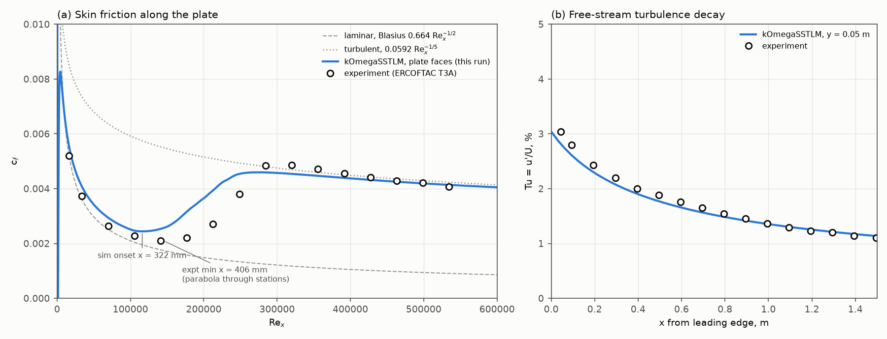

*Measured* (simulation against experiment):
- transition onset (c_f minimum) at x = 322 mm against 406 mm: 84 mm early;
- the 50 % point of the c_f rise at 538 mm against 666 mm: 128 mm early;
- onset Re_x 1.16e5 against 1.45e5, a factor 0.80 (*calculated*).

*Measured* checks ruled out numerical causes: all 1000 iterations with residualControl 1e-12, or 4
MPI ranks, moved the transition positions by at most 0.1 mm. The free-stream Tu decay matches the
data within 8 % at every station, and the turbulent c_f (x > 0.9 m) within 6 %.

*Uncertain:* why the model transitions early. Open alternatives, none tested:
- the correlations of the v2606 implementation (onset and transition-length functions) differ
  from the calibration that matches T3A;
- the local Tu at the leading edge differs from the station values in a way the 8 % agreement
  hides (the onset correlation is steep at low Tu);
- the length-scale (omega) choice of the tutorial inlet, which sets the decay near the leading edge;
- the experiment's own uncertainty in onset, which the 100 mm station spacing limits to about
  +-50 mm.
The tutorial ships no reference simulation, so whether ESI's own run shows the same offset is not
known.

*Inferred* consequence for this project: LM transition positions may sit upstream of reality by an
amount of order 20 % in Re_x. Use LM against SST as **bounds** (free against forced transition)
and compare changes, not absolute transition points.

## 4. Boundary conditions for external flow

A boundary condition tells the solver the value (Dirichlet) or the gradient (Neumann) of each field
on each boundary patch. Every record lists them in `settings.txt` (the `0/` files). The section:

| Patch | U | p | k, omega, ReTheta_t, gammaInt | nu_t |
|---|---|---|---|---|
| `farfield` (circle, 27 c) | `freestreamVelocity` | `freestreamPressure` | `inletOutlet` | `calculated` |
| `blade` (wall) | `noSlip` | `zeroGradient` | k = 0; omega `omegaWallFunction`; gamma, ReTheta_t `zeroGradient` | `nutLowReWallFunction` |
| `frontAndBack` | `empty` (2D) | `empty` | `empty` | `empty` |

- `freestreamVelocity` blends, face by face, between the fixed free-stream value where the free
  stream points into the domain and zero gradient where it points out. `freestreamPressure` does
  the opposite: zero gradient on inflow faces and the fixed free-stream value on outflow faces, so
  U and p are never both fixed on the same face. Both blend continuously with the angle between
  the free-stream velocity and the face normal, so one circular boundary serves as inlet and outlet
  at any angle of attack (v2606 source, `freestreamVelocityFvPatchVectorField.H`,
  `freestreamPressureFvPatchScalarField.H`). The rotor's fixed inlet velocity and fixed outlet
  pressure follow the same rule.
- `inletOutlet` switches on the sign of the face flux: the fixed inflow value where flow enters,
  zero gradient where it leaves.
- On the wall, k = 0 and omega takes its viscous-sublayer value (the wall function blends to it
  at y+ below 1).

The rotor domain is a rectangle: `inlet` (fixed U), `outlet` (fixed p = 0), `sides` (free stream),
and two `cyclicAMI` patches between the rotating and fixed zones (section 10). The blades use
wall functions (`kqRWallFunction`, `omegaWallFunction`, `nutUSpaldingWallFunction`) on the `wf`
mesh.

**Blockage.** The far field must be far enough not to squeeze the flow. Neither model includes the
tunnel walls yet: the section's far field is 27 chords away, the rotor domain 8.75 m by 7.5 m. The
tunnel test-section size is unmeasured (`MEASUREMENTS_NEEDED.md`), so blockage corrections and a
walled run (`--walls` in `rotor2d/run_case.py`) wait for it.

## 5. Courant number and time step

The Courant number of a cell is

    Co = |U| deltaT / dx,

the number of cells a fluid particle crosses in one time step. OpenFOAM evaluates it per cell as
Co = 0.5 deltaT sum_faces |phi_f| / V (phi_f the volume flux through a face, V the cell volume);
for a quad of length l along a wall and height h, with velocity u along and v across the wall,
that is deltaT (|u|/l + |v|/h). OpenFOAM's `adjustTimeStep` shrinks deltaT so that the largest Co
anywhere stays at or below `maxCo`.

- An *explicit* time scheme for advection is stable only up to Co of about 1.
- `pimpleFoam` integrates *implicitly* in time, which stays stable above Co = 1. With one outer
  corrector it is the PISO algorithm, whose pressure-velocity coupling is accurate only up to Co
  of about 1; the outer correctors (`nOuterCorrectors`, 2 here) repeat the coupling within each
  step, which is what allows larger steps. Accuracy and stability still degrade as Co grows, so
  maxCo is a setting to test, not to push.

**The smallest, fastest cells set the step for the whole mesh.** In our section those are the
thin near-wall cells within 0.2 mm of the corners B-outer and A-inner (h0 = 4.5 um, growing by
1.15 per layer), which the shear layer separating from the square corner crosses at 20-60 m/s,
so the |v|/h term dominates (*inferred* from where the high-Co cells sit; *measured*, smoke test
at 0.59 c/U: 99 of 131,061 cells had Co > 2, `section2d/README.md` section 3). At maxCo 5 that gives deltaT of about 2 us (*measured*: 2.13 us at 1.08 c/U; for orientation,
*calculated*, 5 x 20 um / 40 m/s = 2.5 us). One convective time c/U = 2.09 ms at 23 m/s, so at
2.13 us a c/U takes about 980 steps and 150 c/U about 147,000 steps (*calculated*). The first
production case had reached deltaT = 3.37 us at 4.5 c/U (*measured*, 8 Oct log), about 620 steps
per c/U. In the wake, Co stays at or below 0.34 (*measured*): the step there is limited by the
corners, not by the physics.

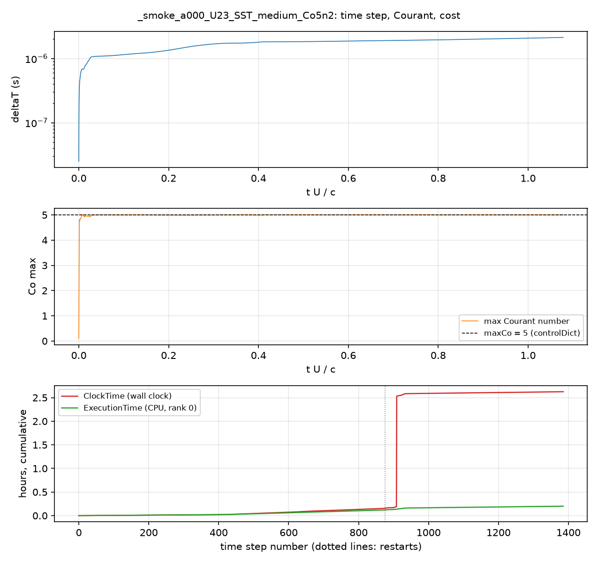

Top: deltaT grows as the start-up transient fades. Middle: Co max sits at 5. Bottom: cumulative CPU
time against wall-clock time.

**Pushing maxCo to 10 diverged** (*measured*, record `_smoke_a000_U23_SST_medium_Co10n2`): the
pressure residual rose from 0.012 to about 0.8 in 0.08 c/U, k reached 2e7 m^2/s^2 and deltaT
collapsed. The residual plot shows the warning signs: a rising p residual, then every field
jumping at once.

**The 7 Oct sleep stall.** The bottom panel of the time-step figure is the cheapest diagnostic of a
run. A stalled run shows a vertical jump in clock time with flat CPU time. On 7 Oct the medium
case's second session logged ClockTime 8886 s against ExecutionTime 282 s, a ratio of 31
(*measured*, `log_excerpt.txt`; earlier in the same session 8785 s against 186 s). The Mac was
asleep (battery at 1 %, pmset log) and resumed on AC. The record's session table catches this
automatically (`clock/CPU` column); a healthy session runs at 1.0-1.3.

## 6. Convergence and averaging windows

Three meanings of "converged", which are easy to confuse:

1. **Within a time step.** The linear solvers and PIMPLE outer correctors reduce the equation
   imbalance (the residual) in each step. In a transient run the *initial* residual does not fall
   to machine zero; it settles into a band set by the time step and the unsteadiness.
   `residuals.png` shows that band.
2. **Statistically stationary.** The start-up transient has died away and the shedding repeats
   with steady amplitude. Check the coefficient history: does the mean drift? The record reports
   `Cd_drift` and `Cl_drift`, the mean of the second half of the window minus the first half.
3. **Window long enough.** The mean of an oscillating signal over a finite window has a sampling
   error. It shrinks with the number of shedding cycles in the window (`n_cycles_window` in
   `summary.json`). The spectrum's frequency resolution is 1/T_window, so 10 cycles resolve St to
   about 10 %.

Our runs start impulsively from uniform flow, discard the first 50 c/U and average over the last
100 c/U (defaults in `run_case.py`). At St of about 0.2 (*assumed* for orientation), 100 c/U holds
about 20 cycles.

The pipeline test (0.3 c/U) shows what an unconverged history looks like: the coefficients are
still in the start-up transient, the shaded window is a fraction of one cycle, and no spectrum can
be computed.

**[pending]** A converged history and its spectrum: `coefficients.png` and `spectrum.png` of the
first production record (`section2d/results/records/a000.0_U23.0_SST_medium_Tu1.0/`). What to
write here: the drift values, n_cycles_window, and whether the Cl peak is sharp.

## 7. Forces, coefficients and the Strouhal number

The `forceCoeffs` function object integrates pressure and viscous stress over the blade and divides
by q A_ref, with q = 0.5 rho U^2 and A_ref = c dz (chord times the 1 mm cell depth). The results
are coefficients **per unit span**:
- Cd along the free stream;
- Cl perpendicular to it, 90 degrees counter-clockwise;
- Cm about the section centroid, counter-clockwise positive (the conventions, and the sign flip
  from OpenFOAM's CmPitch, are in `section2d/README.md` section 1).

**Pressure against viscous drag.** `forces1` splits the force. On this bluff shape pressure drag
dominates (*measured*, Co 5 smoke run after 0.8 c/U: Cd_pressure 2.45 against Cd_viscous -0.015;
`section2d/README.md` section 5).
Pressure taps on a printed section would therefore capture nearly all of Cd (section 11).

The pressure field behind that number (mean Cp of the LM pipeline test over 0.1-0.3 c/U; red =
stagnation in the cup, blue = suction around the tips):

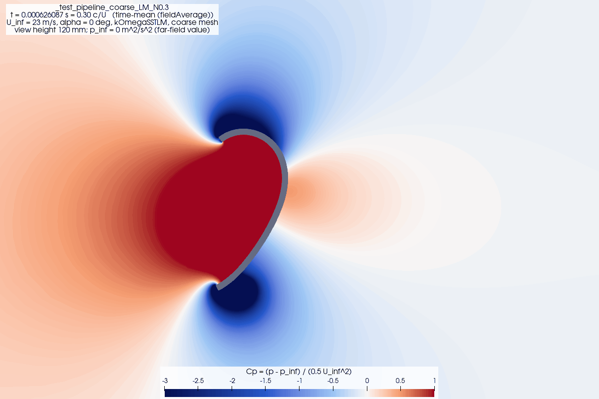

The cup is a uniform dark red because its Cp is above the top of the colour range: about 1.4 on
the concave wall (*measured*, `fields/surface_mean.csv`: 1.39 in this test, 1.41 in the SST
pipeline test; 1.29 instantaneous at 0.59 c/U in the Co 5 smoke run). In a steady incompressible
flow Cp cannot exceed 1, because the total pressure cannot rise above its free-stream value
anywhere. In this start-up flow it can: the unsteady Bernoulli equation
has an extra term, rho dphi/dt, from the vortices growing at the tips (*inferred*). Expect Cp at or
below 1 in the time-mean of a developed production case; a mean Cp well above 1 would point to an
error in p_inf or q.

**Strouhal number.** Shedding vortices alternately from each tip makes the lift oscillate at the
shedding frequency f. The dimensionless form is

    St = f c / U.

*Literature-established:* St is about 0.2 for a circular cylinder over a wide Re range. Bluff bodies
of other shapes sit in a similar band, which is why St is a robust check. The record finds f as the
largest peak of the Cl spectrum (Hann window, zero padding, parabolic peak fit). On a body symmetric
about the flow direction, drag oscillates at 2f, because each vortex pulls the body back once. This
section is not symmetric (tip B curls), so expect a drag component at f as well. *Calculated* for orientation: St = 0.15-0.2
gives 32-43 Hz at 10.2 m/s, 72-96 Hz at 23 m/s and 119-158 Hz at 38 m/s.

**The rotor's coefficients.** These are per unit span, with swept width 2R:
- C_Q = Q'/(q 2R R), from the moment about the shaft;
- C_P = lambda C_Q, with tip-speed ratio lambda = Omega R/U.
The rig measures electrical C_P,el, which includes generator and bearing losses, so CFD and rig
are compared in shape (lambda at peak, zero-torque lambda), not magnitude
(`cfd/post/plot_rotor_cp.py`).

**[pending]** St against angle of attack (`section2d/results/section_polars.png`), and a rotor
`phase_CQ.png` (one blade's torque around a revolution).

## 8. Mesh independence and the GCI

A result is useful only if refining the mesh further would not change it much. The standard
procedure (Roache 1994; Celik et al. 2008) needs three systematically refined meshes:

| Level | Cells (alpha 0) | h0 | Wall spacing at corners / max |
|---|---|---|---|
| coarse | 68,500 | 4.5 um | 64 / 210 um |
| medium | 131,061 | 4.5 um | 45 / 150 um |
| fine | 254,015 | 4.5 um | 32 / 105 um |

(*calculated* by the generator, `section2d/README.md`; images in
`section2d/results/records/_mesh/{coarse,medium,fine}_a000.0/`.)

The steps, for a quantity phi (Cd, St, ...) with phi_1 fine, phi_2 medium, phi_3 coarse:
1. Representative cell size h = (A/N)^(1/2) in 2D. Refinement ratios
   r_21 = h_2/h_1 = (N_1/N_2)^(1/2) = 1.392 and r_32 = 1.383 (*calculated*). Celik et al.
   recommend r > 1.3.
2. Apparent order p from the three values: solve
   p = |ln|eps_32/eps_21| + q(p)| / ln r_21, with eps_32 = phi_3 - phi_2, eps_21 = phi_2 - phi_1,
   q(p) = ln((r_21^p - s)/(r_32^p - s)) and s = sign(eps_32/eps_21), by fixed-point iteration.
3. Extrapolated value phi_ext = (r_21^p phi_1 - phi_2)/(r_21^p - 1).
4. Fine-grid convergence index GCI_fine = 1.25 |(phi_1 - phi_2)/phi_1| / (r_21^p - 1). It is an
   uncertainty band on phi_1 (safety factor 1.25 for three grids).

Three cautions for these cases:
- Each phi is a time mean with its own sampling error (section 6). A mesh difference smaller than
  the run-to-run spread is not resolved.
- If eps_32/eps_21 < 0 (oscillatory convergence), p is not meaningful; report the range instead.
- The three levels keep h0 = 4.5 um and change the growth ratio and the wall spacing, so the
  refinement is not geometrically similar next to the wall, which the method assumes. The apparent
  order p may then differ from the formal order of the schemes (2); a p far from 2 is a warning,
  not a result.

**[pending]** Queue priority 1 runs alpha 0/90/180 on all three levels. Table to fill:

| Quantity | coarse | medium | fine | p | phi_ext | GCI_fine |
|---|---|---|---|---|---|---|
| Cd (alpha 0) | | | | | | |
| St (alpha 0) | | | | | | |

## 9. Roughness: sand-grain ks against Ra

**ks is not a measurement.** CFD rough-wall models use the *equivalent sand-grain roughness* ks:
the grain size of Nikuradse's (1933) closely packed sand that produces the same drag increase in
fully rough flow. It is a hydrodynamic property of a surface, not a geometric one.

**Ra is a geometric measurement.** Ra is the arithmetic mean deviation of the roughness profile;
Pa is the same quantity for the primary profile, before the cut-off filter (lambda_c) separates
roughness from waviness. The project's surfaces (*measured*, roughness report table):

| Rotor | Fuzzy skin (mm) | Pa (um) | Ra (um) | Peak power change vs Plain |
|---|---|---|---|---|
| Plain | none | 19.0 | 12.7 | reference |
| FS 0.05 | 0.050 | 13.9 | 9.4 | +1.8 % [-0.6, +4.2] |
| FS 0.10 | 0.101 | 13.2 | 8.2 | +12.8 % [+10.1, +15.5] |
| FS 0.20 | 0.202 | 28.7 | 10.3 | +16.2 % [+13.5, +19.0] |

Neither Pa nor Ra ranks the rotors by power. There is no universal ks-Ra conversion
(*literature-established*). In the fully rough regime, Flack and Schultz (2010) found that ks
correlates best with the rms height and the skewness of the height distribution (their
correlation is reported as ks = 4.43 k_rms (1 + Sk)^1.37; check the paper before quoting it).
Our textures are not in that regime (below).

**Roughness Reynolds number.** What matters to the flow is the roughness height in wall units,
ks+ = u_tau ks/nu (*literature-established* regimes):
- hydraulically smooth below about 5;
- transitionally rough between about 5 and 70;
- fully rough above about 70.

*Calculated, rough:* the smoke test's y+ (mean 0.2, corner maximum 1.5, first cell centre at
2.25 um, 23 m/s, start-up flow) gives u_tau of about 1.3 m/s on most of the wall and about
10 m/s at the corners. Taking ks equal to the scan height k of the meeting notes (38 um for Plain,
FS 0.05 and FS 0.10; 84-97 um for FS 0.20; an *assumption*, since ks is not k), ks+ is about 3 on
most of the wall and up to 25 at the corners for 38 um, and about 8 to 60 for 90 um. So the
surfaces are *smooth to transitionally rough*, not fully rough.

What this means for the plan (Stage 2):
- `nutkRoughWallFunction` (OpenFOAM's rough wall function, inputs Ks and Cs) shifts the log law.
  It needs a wall-function mesh, with the first cell centre above the roughness, and it does not
  model roughness-induced transition.
- OpenFOAM v2606 has no roughness-induced transition model (`cfd/PLAN.md`).
- The hypothesis from the meeting is that the fuzzy skin trips the boundary layer. The section
  model brackets it with free transition (LM) against forced transition (SST, turbulent from the
  leading edge). Rough-wall SST cases (ks 0-400 um) add the skin-friction penalty on top.
- The roughness Reynolds number based on the boundary-layer velocity at height k (Re_k = u_k k/nu;
  meeting notes of 7 Oct, after Wilcox et al. 2017) is the transition criterion. The ks+ above is
  the drag criterion. Keep the two apart.

## 10. Rotating meshes with AMI

A rotor needs part of the mesh to turn. The rotor mesh has two zones:
- a disc `rotor` (cellZone) containing the blades, which turns as a rigid body
  (`dynamicMeshDict`: `solidBody`, `rotatingMotion`, omega = lambda U/R);
- the fixed outer domain.
Their shared circle (r = 128 mm) is split into two patches, `AMI1` and `AMI2`, whose faces do not
match once the disc turns. The *arbitrary mesh interface* (`cyclicAMI`) interpolates fluxes across
them, using the overlap area of each face pair as weights.

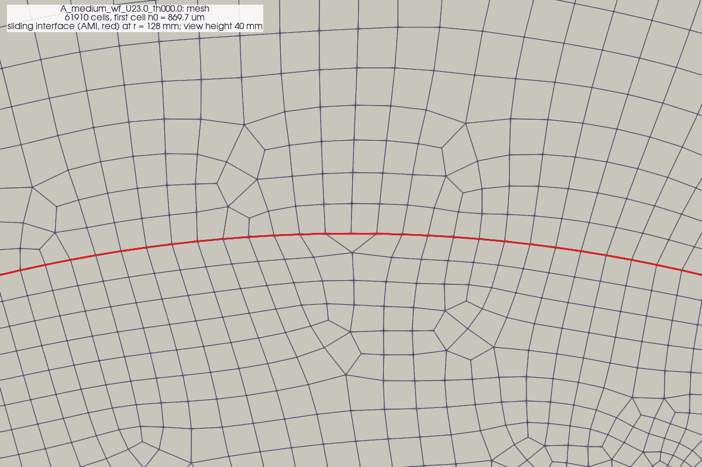

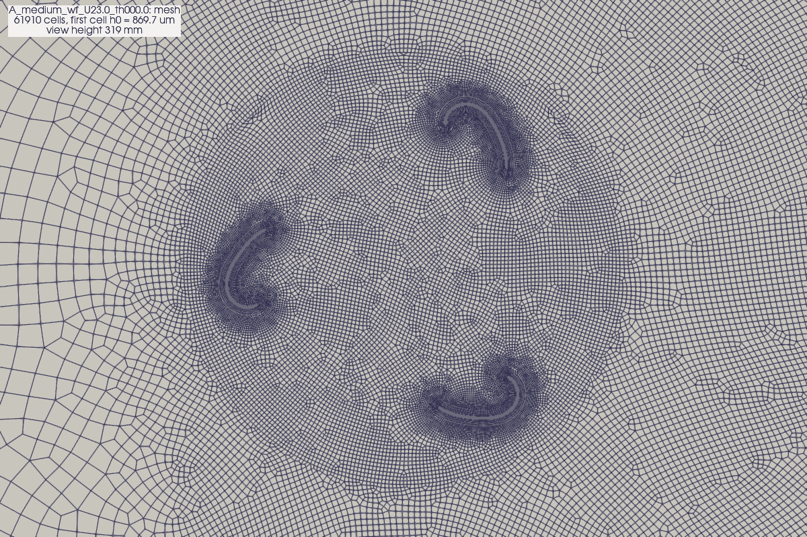

Checks:
- **AMI weights.** Each face's weights should sum to 1 (full overlap). The `AMIWeights1` function
  object logs min and max. The coarse smoke run shows 1.00002-1.00003 (*measured*); values far
  from 1 mean a gap or overlap in the interface and lost conservation. The record copies them to
  `summary.json` (`ami_weight_min`, `ami_weight_max`).
- **Time step.** The blades move through the fixed mesh. maxDeltaT is T/720 (0.5 degrees per
  step), and Co still applies.
- **Start-up.** C_Q needs several revolutions to become periodic. The default is 8 revolutions,
  averaging the last 3; `CQ_drift_last_two_rev` in the queue's summary measures the remaining
  drift.

Static rotor cases (stage 3a) freeze the blades at an azimuth theta on the same mesh and give the
static torque against theta. They are cheaper and test the assembly hypotheses A and B before the
rotating runs.

**[pending]** `coefficients.png` and `phase_CQ.png` of the first finished rotating case, e.g.
`rotor2d/results/records/A_rot_U23.0_lam0.150_SST_medium/`.

## 11. Validating without a load cell

The rig measures electrical power, not blade forces. Options from `cfd/PLAN.md`, with the record
output each one checks:

| Check | Measurement | Record output to compare | Status |
|---|---|---|---|
| Bluff-body drag | Published drag of semicircular shells: about 2.3 concave side to the wind, 1.2 convex (literature; not this blade) | `Cd_mean` at alpha 0 and 180 | available now |
| Shedding frequency | Accelerometer (Nano 33 BLE Sense, >= 400 Hz) on a cantilevered printed section | `St`, `f_shed_Hz`, `spectrum.png` | needs the test |
| Pressure distribution | Taps on a printed section, cheap differential sensors | `fields/surface_mean.csv` (Cp along the wall) | needs the test |
| Rotor curve shape | Rig lambda at peak C_P,el (0.120-0.122 at 23 m/s) and light-load lambda (0.158) | `CP_mean` against lambda; zero-torque lambda | rig data exist (`rotor2d/results/rotor_cp_compare_U23.json`) |
| Direct section forces | Bar load cell and HX711 (about $10-15) | `Cd_mean`, `Cl_mean` | needs a mount |

Pressure drag dominates (section 7), so taps on the mean-Cp positions of `surface_mean.csv` would
give nearly all of Cd. They also show whether the model's separation points (Cf sign changes) are
right.

## 12. Running on a cluster (Unity)

**Why.** On the laptop the cases ran one at a time per queue: at the 8 Oct pace the Stage 1 queue
alone would have finished on 22-23 Oct (*calculated* from the measured 9.4 h per medium case),
and the Mac had to stay awake and plugged in. A cluster runs many cases at once, each on more
and faster cores. The cases, meshes and OpenFOAM version stay the same; only the machine
changes. How to use it: `cfd/hpc/README.md`.

**The parts of a cluster.**
- *Login node.* Where `ssh unity` lands. It is shared by everyone and capped at about 2 cores
  and 8 GB per user (*measured*, 9 Oct). Use it to copy files and submit jobs, never to run a
  solver.
- *Compute nodes.* Where jobs run. The URI partition `uri-cpu` has 49 nodes of 64 Xeon cores
  each (*measured*, `sinfo`).
- *Slurm, the scheduler.* A job script starts with `#SBATCH` lines that ask for resources:
  account, partition, number of MPI tasks, memory, time limit. Slurm starts the job when a
  node has them free and stops it at the time limit. Useful commands: `squeue --me` (my jobs),
  `scancel <id>`, `sacct -j <id>` (what a finished job used).
- *Account and limits.* The lab account `pi_sodhi_uri_edu` may use up to 768 cores on
  `uri-cpu` at once (*measured*, the QOS limit). `submit.py` keeps us to 512 so labmates keep a
  share.
- *Container.* Unity has no OpenFOAM v2606 module, so the official OpenFOAM image runs through
  Apptainer: a whole Linux system with OpenFOAM in one file (`openfoam-run_2606.sif`). It is
  built from the same source commit as the Mac app. Only the compiler differs, so results
  should agree to round-off (*inferred*).

**Parallel runs are the same on both machines.** `decomposePar` cuts the mesh into N pieces,
`mpirun -np N pimpleFoam -parallel` gives each piece to one core, and neighbouring pieces swap
boundary values every step. More ranks mean less work per core, but more of the time goes to
communication. Doubling the ranks therefore never quite halves the run time.

| Run (Stage 1 medium mesh, 131k cells) | Rate | Relative |
|---|---|---|
| Unity, 16 ranks | 16.2 steps/s | about 5× the Mac (*measured*, 9 Oct benchmark job) |
| Mac, 4 ranks (three queues sharing it) | 3.6–4.1 steps/s | (*measured*) |

So `submit.py` uses 8 ranks for medium meshes, which spends fewer core-hours per case, and 16
only for the large fine and texture meshes.

**Time limits and resuming.**
- Every job has a time limit. Slurm sends a stop signal 15 min before it; the solver stops, and
  the case keeps its last written time.
- The next submission resumes from that time, the same mechanism as `queue.py --pause` on the
  Mac.

**Moving a half-finished case between machines** (`cfd/hpc/migrate.py`, used on 9 Oct for three
Mac cases):
1. `reconstructPar -latestTime` joins the latest time of the 2 or 4 pieces back into one field
   set. This includes `uniform/`, where the averaging function objects keep their running sums.
2. That time is uploaded.
3. `decomposePar` cuts it again for the job's 8 ranks, and the solver continues to the same end
   time.

A restart writes the force and probe files into a new time folder. The summaries already join
these.

## 13. References

- Celik, I. B., Ghia, U., Roache, P. J., Freitas, C. J., Coleman, H., and Raad, P. E. (2008).
  Procedure for estimation and reporting of uncertainty due to discretization in CFD applications.
  *J. Fluids Eng.* 130(7), 078001. doi:10.1115/1.2960953
- Flack, K. A., and Schultz, M. P. (2010). Review of hydraulic roughness scales in the fully rough
  regime. *J. Fluids Eng.* 132(4), 041203. doi:10.1115/1.4001492
- Langtry, R. B., and Menter, F. R. (2009). Correlation-based transition modeling for unstructured
  parallelized computational fluid dynamics codes. *AIAA J.* 47(12), 2894-2906. doi:10.2514/1.42362
- Menter, F. R. (1994). Two-equation eddy-viscosity turbulence models for engineering applications.
  *AIAA J.* 32(8), 1598-1605. doi:10.2514/3.12149
- Nikuradse, J. (1933). Stromungsgesetze in rauhen Rohren. VDI-Forschungsheft 361 (English: NACA
  TM 1292, 1950).
- Roache, P. J. (1994). Perspective: a method for uniform reporting of grid refinement studies.
  *J. Fluids Eng.* 116(3), 405-413. doi:10.1115/1.2910291
- Savill, A. M. (1993, 1996). ERCOFTAC T3A transition test case (data in the OpenFOAM tutorial).
- Spalart, P. R., and Rumsey, C. L. (2007). Effective inflow conditions for turbulence models in
  aerodynamic calculations. *AIAA J.* 45(10), 2544-2553. doi:10.2514/1.29373
- Wilcox, B. J., White, E. B., and Maniaci, D. C. (2017). Roughness sensitivity comparisons of wind
  turbine blade sections. SAND2017-11288. doi:10.2172/1404826

Verify each reference against the source before citing it in a report; the DOIs above were not
re-checked for this log.
