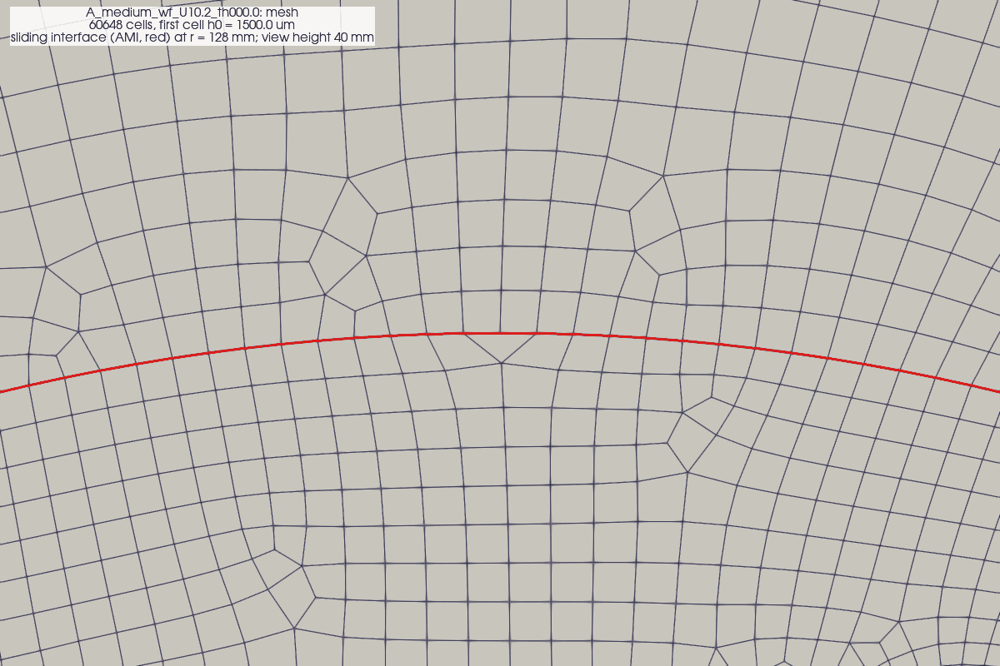
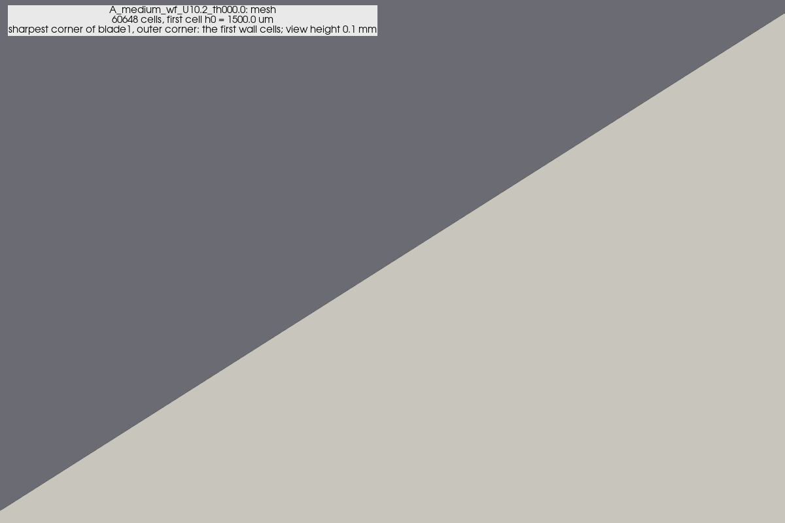
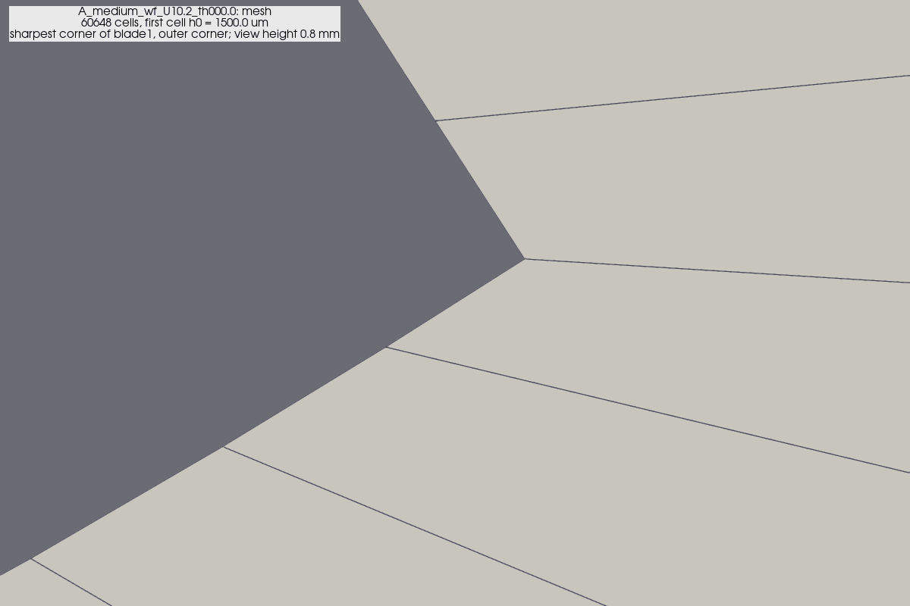
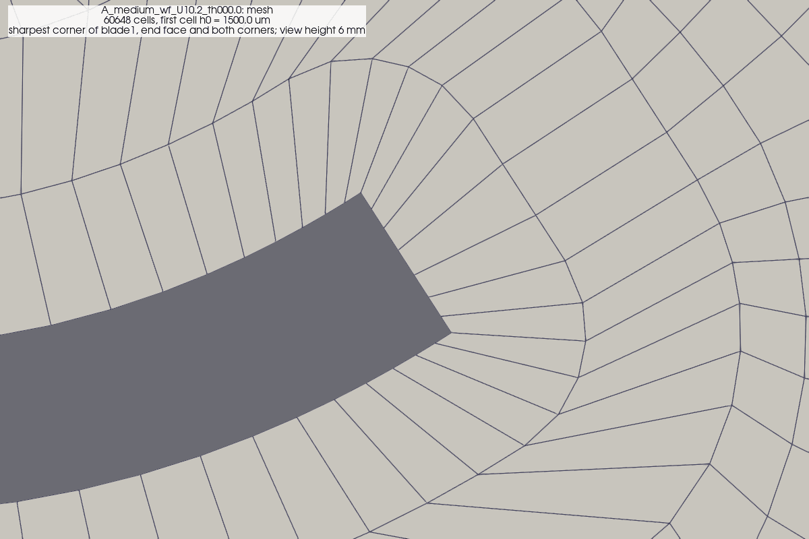
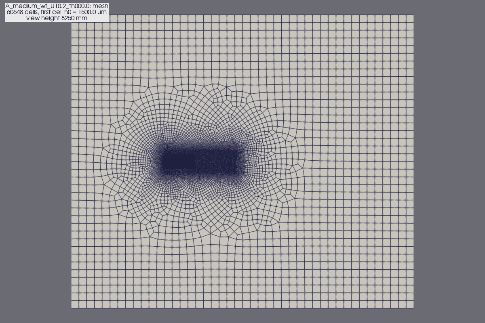
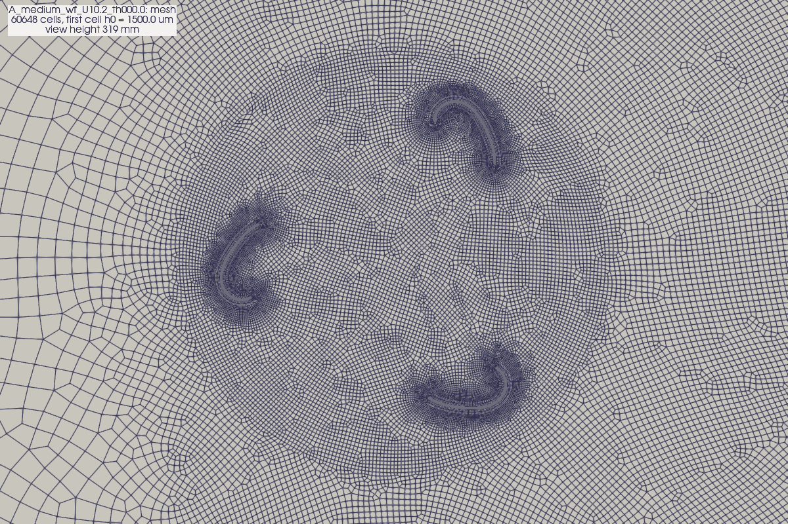

# Mesh record: `A_medium_wf_U10.2_th000.0`

Mesh images of `cfd/rotor2d/runs/_mesh/A_medium_wf_U10.2_th000.0` (no flow solution), rendered by `cfd/post/render_fields.py` on 2026-10-07. 60648 cells; first cell height 1.5e+03 um. Quality: `checkMesh.log`; generator parameters: `mesh_info.json`.

