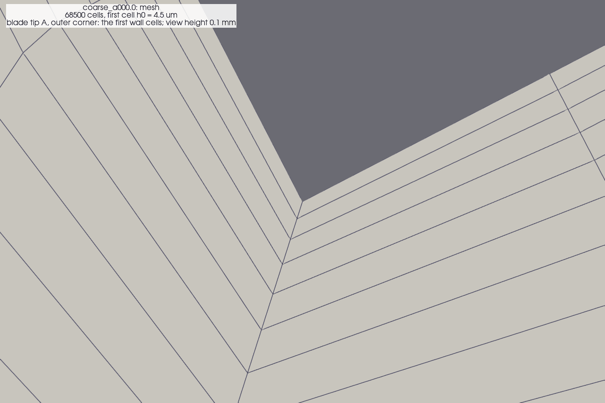
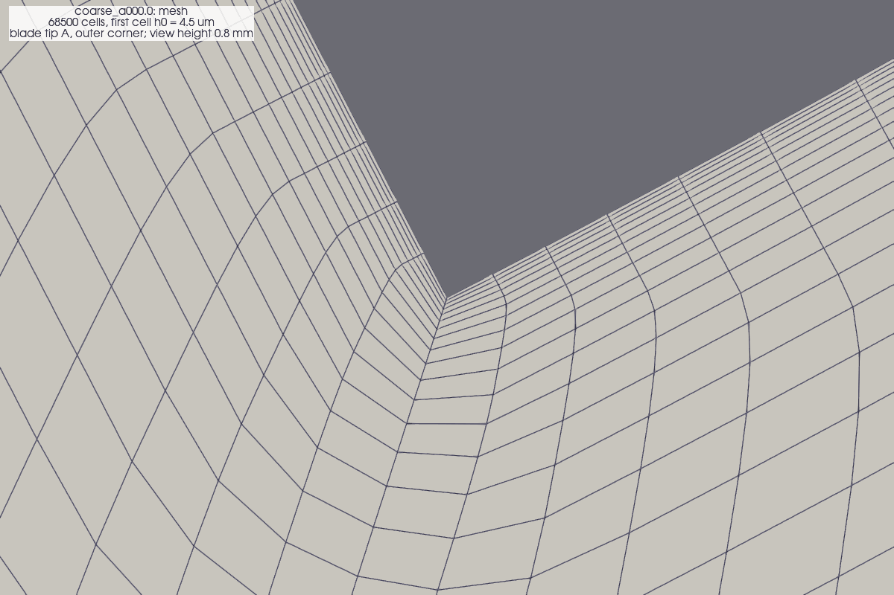
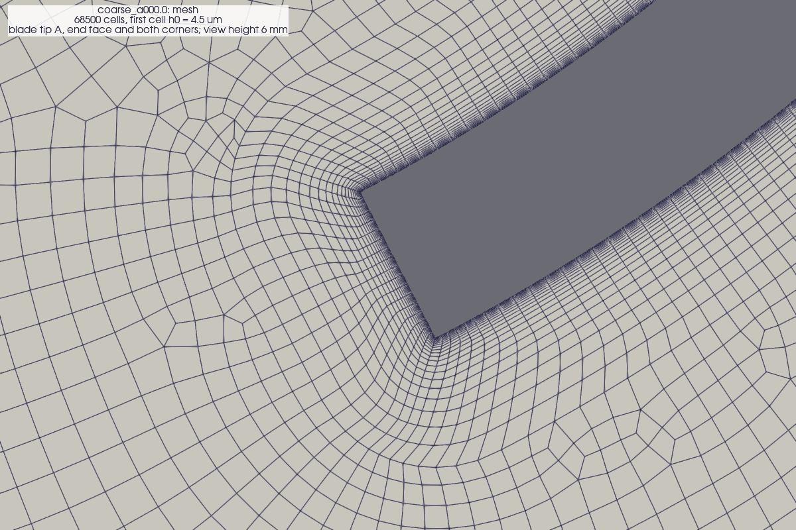
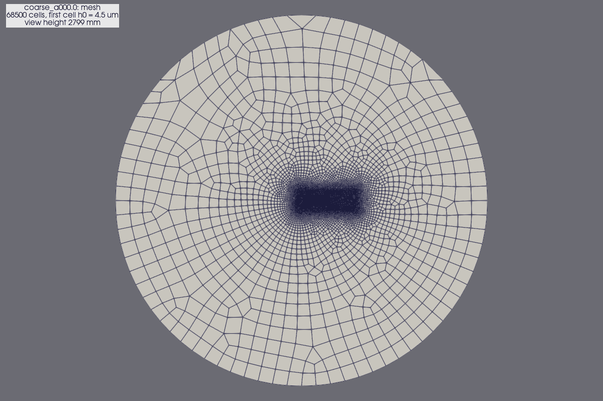
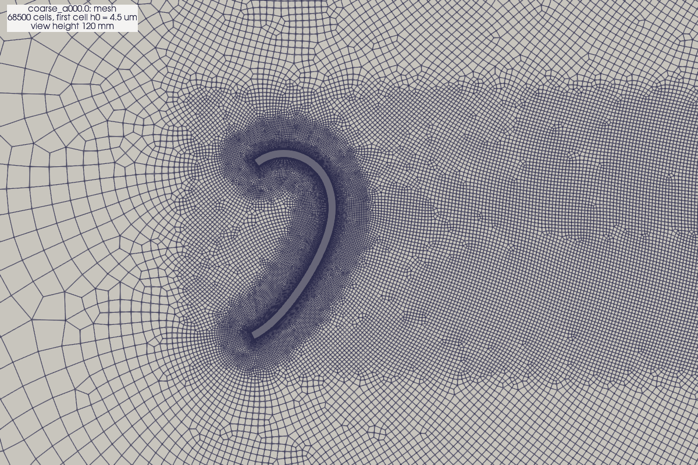

# Mesh record: `coarse_a000.0`

Mesh images of `cfd/section2d/runs/_mesh/coarse_a000.0` (no flow solution), rendered by `cfd/post/render_fields.py` on 2026-10-07. 68500 cells; first cell height 4.5 um. Quality: `checkMesh.log`; generator parameters: `mesh_info.json`.

