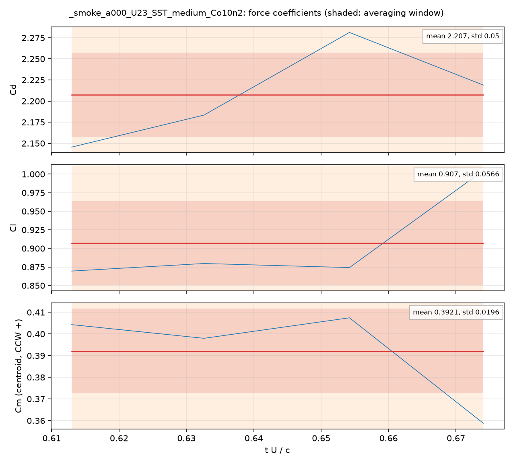
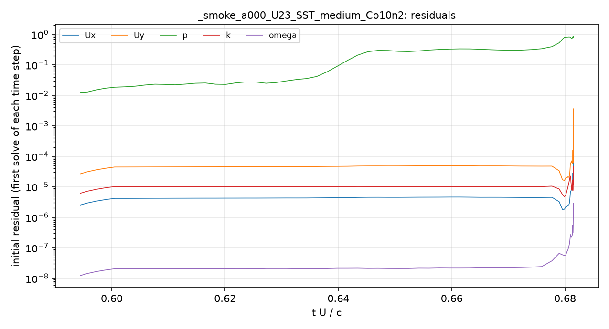
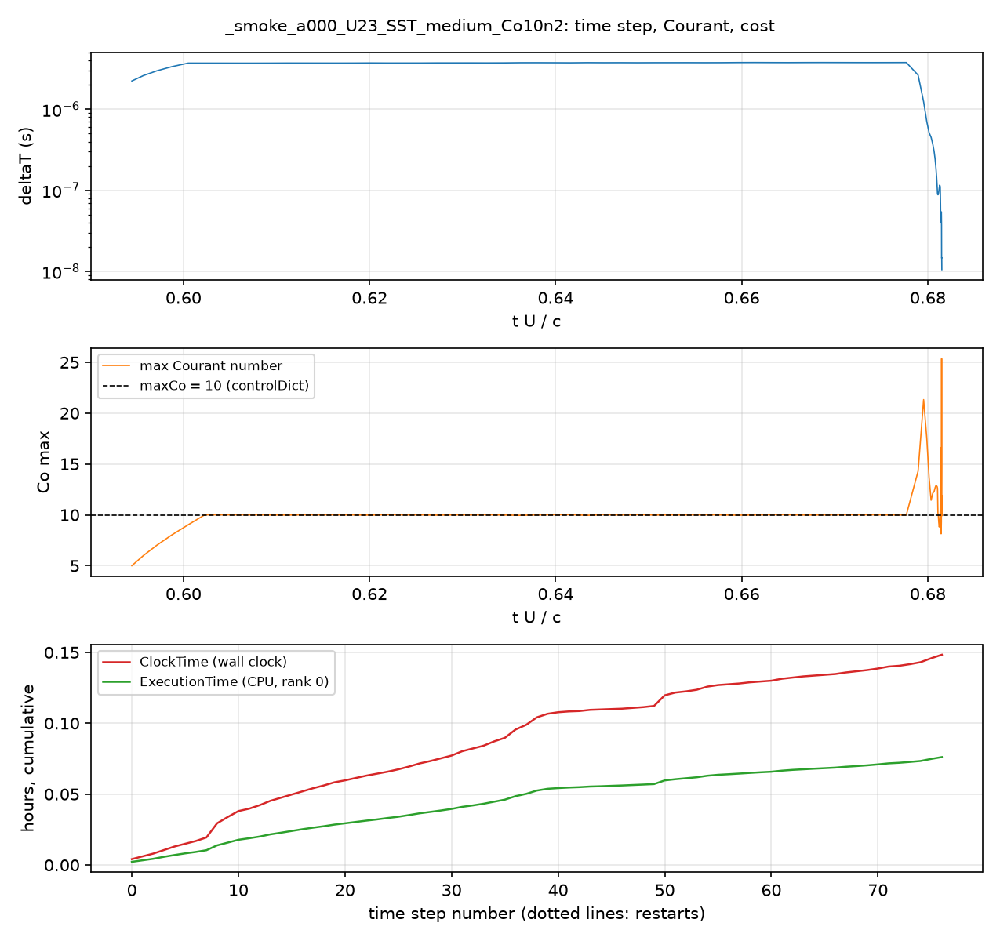
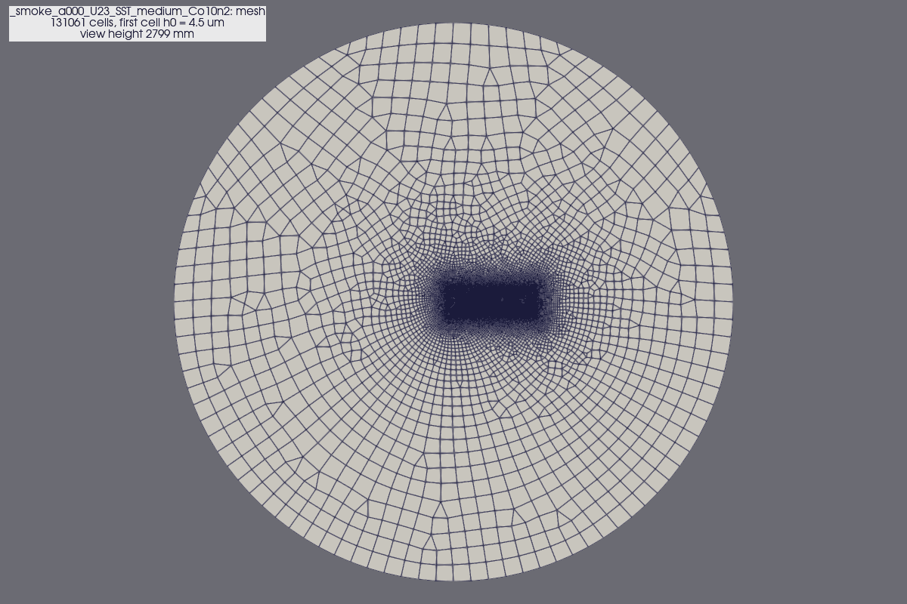
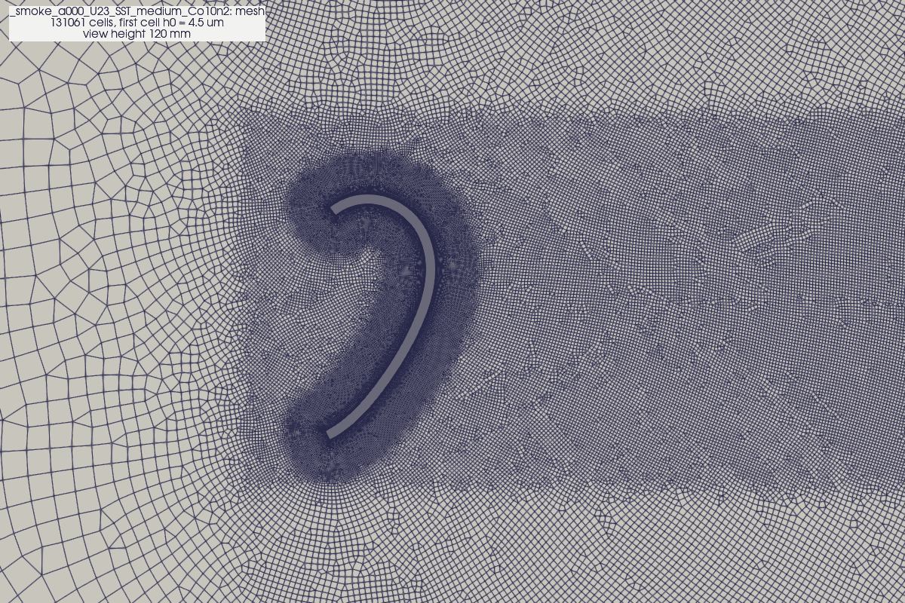
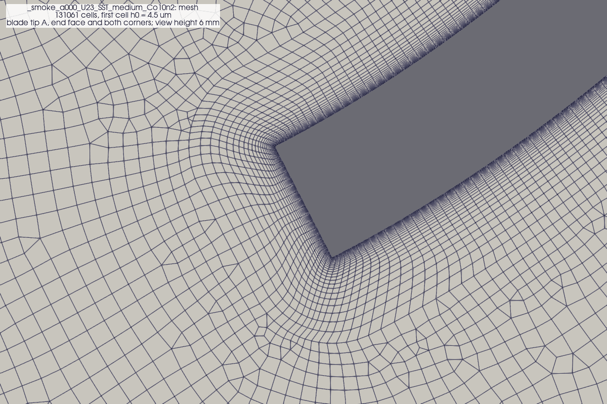
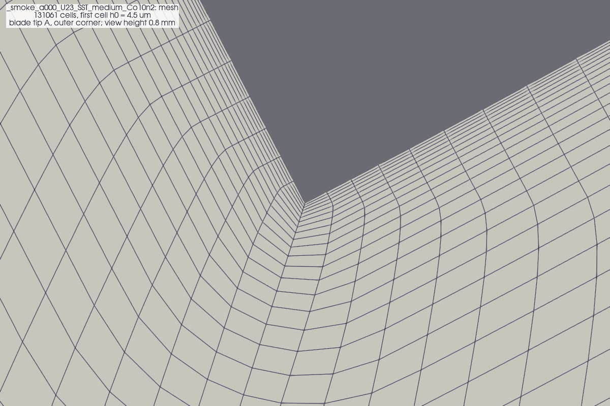
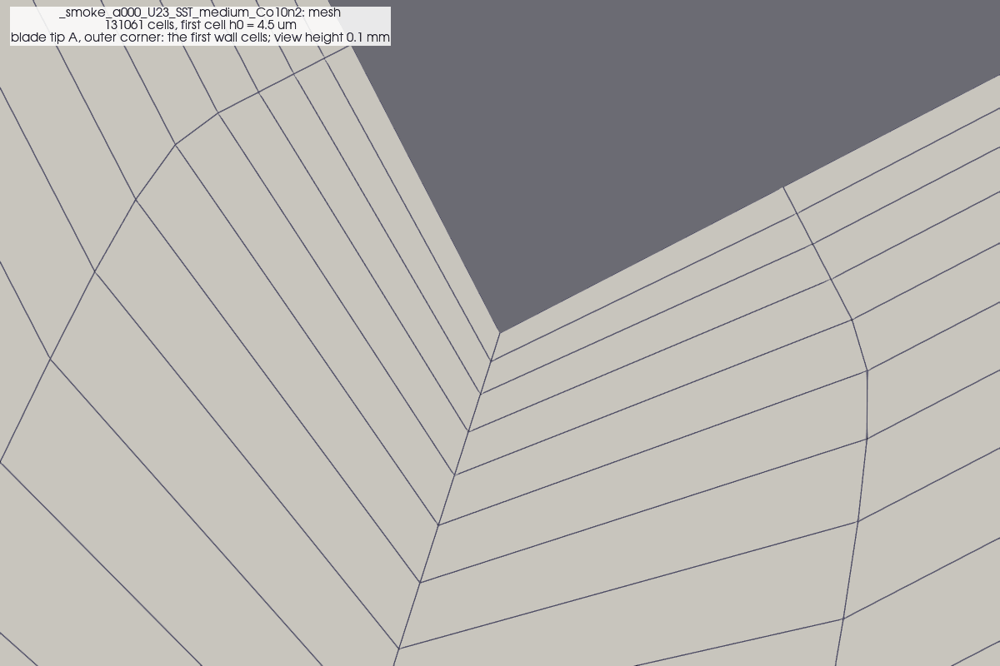

# Record: `_smoke_a000_U23_SST_medium_Co10n2`

Recorded 2026-10-08T07:51:48 by `cfd/post/record_case.py` from `cfd/section2d/runs/_smoke_a000_U23_SST_medium_Co10n2`. Status when recorded: **finished** (solver log ends with End).

> **Test record.** The folder name starts with `_`: a smoke, pipeline or scheme test, not a production case. Its numbers describe the test, not the blade; see `cfd/docs/RECORDS.md` (test records).

> The averaging window is too short for a spectrum (under 32 samples); about 10 or more shedding cycles are needed before means and St are converged (cfd/docs/LEARNING_LOG.md section 6).

> system/caseParameters differs from case.json for endTime (0.3130434782608696 in case.json, 0.0208696 used), maxCo (5.0 in case.json, 10 used); the values used by the solver are reported here.

> case.json names this case `a000.0_U23.0_SST_medium_Tu1.0`; the folder was renamed (a test copy).

> The averaging window is incomplete: 0.613 to 0.6741 t U / c was available against an intended 100 t U / c. Means and the Strouhal number are not converged.

## Key numbers

| Quantity | Value |
|---|---|
| Angle of attack | 0 deg |
| Free stream | 23 m/s |
| Re (c = 48 mm) | 7.28e+04 |
| Turbulence model | kOmegaSST |
| Tu at the section | 1 % |
| Free-stream turbulence | no decay control (7 Oct set-up): far-field Tu 1.89 % decays to the section value; nu_t/nu 38.5 far field, 34.7 at the section; length scale 2 mm |
| Time-step control | maxCo 10, 2 outer correctors |
| Mesh | medium, 131061 cells, first cell 4.5 um, checkMesh log not in the case |
| Simulated | 0.001422 s = 0.6815 t U / c (6.8 % of endTime) |
| Time steps | 77, deltaT mean 2.39e-06 s, max Co mean 10.8 |
| Cost | CPU 0.0762 h, clock 0.148 h, 3.56 s CPU per step |
| Cd (mean +/- std) | 2.207 +/- 0.05 |
| Cl (mean +/- std) | 0.907 +/- 0.0566 |
| Cm (mean +/- std) | 0.3921 +/- 0.0196 |
| Cd pressure / viscous | 2.222 / -0.0152 |
| Averaging window | 0.613 to 0.6741 t U / c (incomplete) |

## Plots and how to read them

### Force coefficients against time

The loads on the blade, made dimensionless: Cd = drag/(q c), Cl = lift/(q c), Cm = moment/(q c^2) per unit span, with q = 0.5 rho U^2. Time is in convective units t U/c: one unit is the time the free stream takes to travel one chord. The start is a transient (the flow is impulsively started from uniform flow) and must be discarded. The orange band is the averaging window; the red line and band are the window mean and +/- one standard deviation. A converged URANS run shows a statistically steady signal in the window: the oscillation (vortex shedding) repeats with constant amplitude and the mean does not drift. Compare the two halves of the window (the `*_drift` entries in summary.json) to check this.

### Residuals

For each solved field (Ux, Uy, p, k, omega, and gammaInt, ReThetat for the transition model) the initial residual of the first solve in each time step: the normalised imbalance of the discretised equation before the linear solver works on it. In a transient (PIMPLE) run residuals do not fall to machine zero; they settle to a band whose level depends on the time step and on how unsteady the flow is. Watch for a rising trend (divergence), sudden spikes (a bad cell, or the time step jumping), or the pressure residual not dropping within a step.

### Time step, Courant number and cost

Top: the adaptive time step deltaT. Middle: the largest Courant number Co = U deltaT / dx in the mesh, which the solver holds at or below maxCo by shrinking deltaT; the smallest, fastest cells (here the blade corners) set the time step for the whole mesh. Bottom: cumulative CPU time (ExecutionTime) against wall-clock time (ClockTime) over the time steps. On a healthy run the two lines rise together; when the clock line runs away from the CPU line the solver was not running, for example because the Mac slept (7 Oct, one session: ClockTime 8886 s against ExecutionTime 282 s). Dotted lines mark restarts.

(No spectrum plot: 4 samples in the averaging window (32 needed).)

## Field images (ParaView, `fields/`)

Rendered by `cfd/post/render_fields.py`. Mesh only: the case kept no flow fields after t = 0 (finished cases keep the last write; test copies may keep none). Colour ranges are fixed per quantity so records of different cases can be compared side by side. The grey shape is the blade (a hole in the mesh).

**mesh_domain**: Whole computational domain. The far-field boundary is many chords away so that it does not disturb the flow near the blade.

**mesh_near**: The mesh within a few chords: a body-fitted layer of thin cells around the blade, a refined band where the wake goes, and coarser cells further out.

**mesh_cornerA_6mm**: Close-up of one blade tip: the 1.85 mm end face and its two square corners.

**mesh_cornerA_0p8mm**: Closer: the wall-normal cell layers growing away from the wall at a geometric rate.

**mesh_cornerA_0p1mm**: Closest: the first cells at the corner. Their height (first cell h0) sets y+; compare with the y+ plots.

- Note: no field data: mesh images only

## Other files

- `summary.json`: the numbers above and more (sessions, warnings, y+ statistics).
- `settings.txt`: every dictionary that defines the run, and the boundary conditions.
- `log_excerpt.txt`: solver sessions (CPU against clock time), warnings, header, last 50 lines.
- `coefficients.csv`, `residuals.csv`: decimated histories (at most 5000 rows) for re-plotting.
- `checkMesh.log`, `mesh_info.json`: mesh quality and generator parameters.

Background for every plot: `cfd/docs/LEARNING_LOG.md`.
