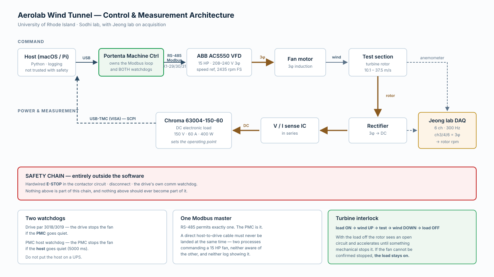

# Architecture



Open `diagrams/architecture.svg` for the full-size version.

---

## The shape of it

Two paths, and it's worth keeping them separate in your head:

**Command** — a profile in m/s becomes a frequency setpoint in a register.
Velocity → Hz through the calibration (pointwise, never by scaling mean and
amplitude separately), realizability check, optional feedforward, then the
player streams it on absolute deadlines.

**Measurement** — the drive reports frequency and current; the velocity source
reports wind speed independently. Both go in the log, and **the gap between
commanded and measured is the tunnel's dynamic response — data, not error.**
`analyze.py` extracts τ from any run because of it.

Throughout the UI: **gold is commanded, Keaney blue is measured.** That
convention is load-bearing. Most of these plots exist to show the difference.

---

## Layers

| Layer | Files | Change it? |
|---|---|---|
| Interfaces | `scripts/rpm.py`, `src/run.py`, `webapp/` | freely |
| Experiment | `gusts`, `feedforward`, `characterize`, `preflight`, `analyze`, `fit_sensor` | freely |
| Execution | `player`, `velocity_loop`, `velocity_source`, `calibration`, `config` | carefully |
| Drive semantics | `acs550`, `simulator` | don't |
| Transport | pymodbus | — |

The split matters. The lower layers encode things that are true about *this
drive* and easy to get wrong — control word bit meanings, the register offset,
the rising-edge latch. The upper layers encode things about *your experiment*
and should change as the research does.

`gusts.py` deliberately imports nothing from the others, so you can design and
plot profiles on any machine with no drive and no serial port.
`examples/gust_demo.py` does exactly that, and it's the right place to iterate
on a test matrix.

---

## One owner of the bus

RS-485 is half duplex with exactly one master. A Flask app is the opposite by
default — every request in its own thread. So the drive is owned by **one**
object with **one** poll thread, and everything goes through it.

Get this wrong and frames collide on the wire, producing CRC errors that look
exactly like a wiring fault. It's an unpleasant thing to debug because the
symptom points at the cable.

---

## Where safety lives

Read downward. Each layer holds even if everything above it is wrong, absent,
or malicious.

| Layer | Mechanism |
|---|---|
| **Hardware** | Hardwired E-stop, fused disconnect. Independent of everything. |
| **Drive** | Comm watchdog `3018`/`3019`. Stops the fan if the host dies, sleeps, or the cable is kicked. |
| **Server** | Soft `hz_limit`, E-stop latch, single bus owner, pre-flight. In `controller.py`, never in the browser. |
| **Library** | Context manager always stops. Abort on fault or lost comms. Over-limit profiles refused, not clipped. |
| **UI** | Confirmations, warnings, staleness banners. **Convenience only.** |

The drive-level watchdog is the one that makes the rest acceptable. It's why a
Raspberry Pi and a web browser are reasonable places to command a 15 HP fan
from — and why **the Pi must not be on a UPS.** If it loses power you want it
to die hard so the watchdog trips. Battery-backing the controller defeats the
layer underneath it.

---

## Register mapping, once

Modbus has two numbering schemes, off by one. The manual says "holding
register 40001"; on the wire that's address 0.

```
wire_address = register_number − 40001
```

The drive exposes two things through the same space:

- A fixed control/status block at **40001–40006**
- **Every parameter**, at 4xxxx where xxxx is the parameter number.
  Parameter 1105 → register 41105 → wire address **1104**. Hence `P − 1`.

`selftest` verifies this against your actual drive rather than trusting the
documentation.


---

## The load half

Added after the drive half was working. It shares `tunnel.json` and nothing
else — the two halves touch at exactly two places, and both are deliberate.

```
peak_finder.py     the measurement: ramp current, find the power roll-off
    ▲
    ├── load_ramp.py     one wind speed, driven by hand
    └── blade_sweep.py   all fourteen, driving the fan itself
            │
            ├── chroma_load.py  ── SCPI ──► Chroma 63004
            │      └── TurbineInterlock ── the ordering rule, enforced
            └── acs550.py ── transport.py ── PMC ──► drive
```

**`TurbineInterlock` is the first touch point.** It holds both instruments
because neither can see the other: the drive cannot know the load is off, and
the load cannot know the fan is turning. That coupling has to live above both
drivers, and it is the only place in this package that is genuinely about
safety rather than correctness.

**The PMC watchdog is the second.** Any load-side loop that runs long without
talking to the drive must tick `PMCTransport.keepalive_tick()`. `blade_sweep`
runs a `DriveWatch` thread for exactly this, which also gives it actual fan rpm
and motor current to log against every dwell.

**`load_sim.py` mirrors `simulator.py`.** The drive half has a simulated drive
so profiles can be rehearsed without hardware; the load half has a simulated
rotor so the peak-finding logic can be developed and regression-tested without
a tunnel. Both present the same interface as the real thing, so the code under
test is the code that ships.
